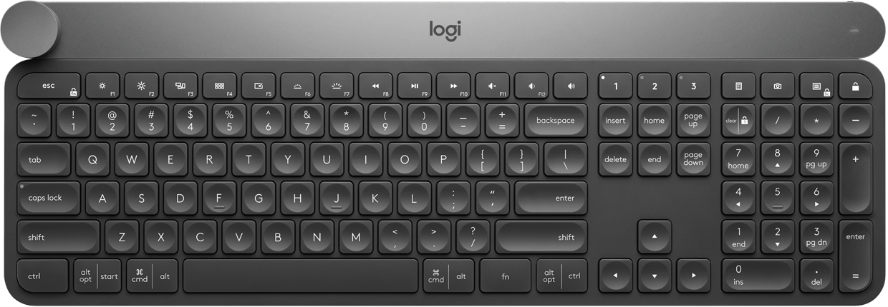
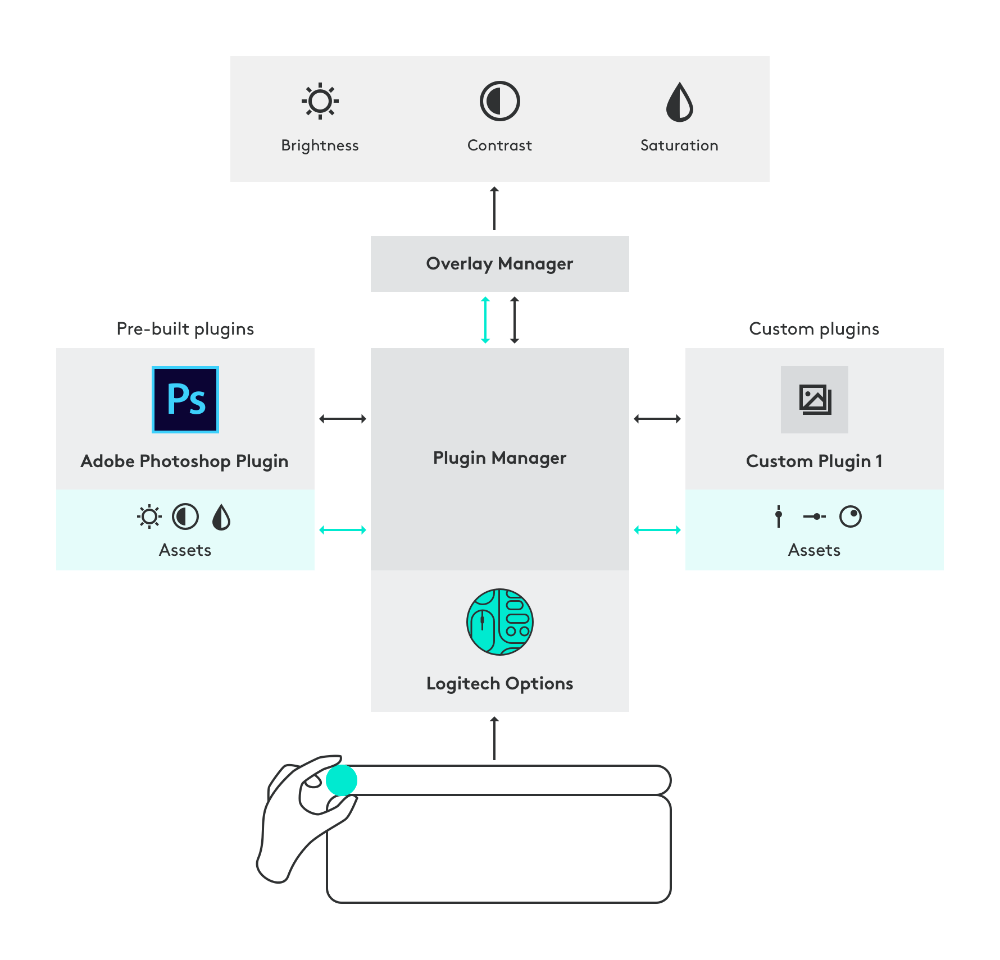
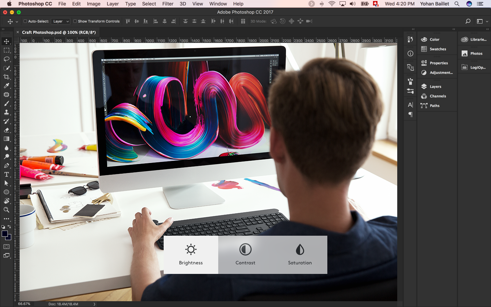
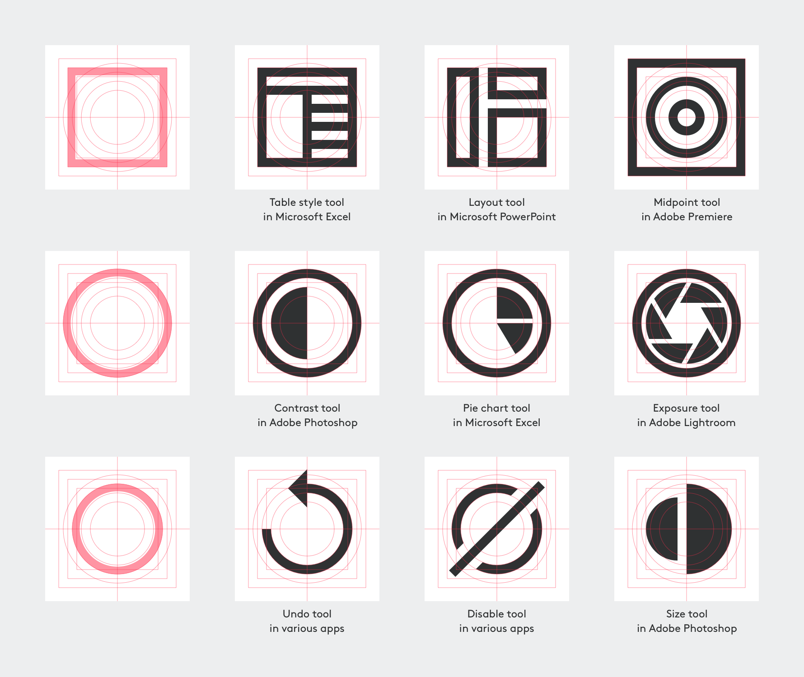

# Craft Crown SDK

<!-- @import "[TOC]" {cmd="toc" depthFrom=1 depthTo=6 orderedList=false} -->
<!-- code_chunk_output -->

- [Craft Crown SDK](#craft-crown-sdk)
    - [1. Introduction to the Logitech Crown](#1-introduction-to-the-logitech-crown)
    - [2. Introduction to the Logitech Crown SDK](#2-introduction-to-the-logitech-crown-sdk)
    - [3. Types of Apps and Benefits](#3-types-of-apps-and-benefits)
    - [4. Developing for the Crown](#4-developing-for-the-crown)
    - [5. What You'll Need](#5-what-youll-need)
    - [6. High-Level Architecture](#6-high-level-architecture)
    - [7. Design Guidelines](#7-design-guidelines)
        - [7.1 Crown interactions](#71-crown-interactions)
        - [7.2 Overlay](#72-overlay)
        - [7.3 Tool icon](#73-tool-icon)
    - [8. Sample Code and Sample Application](#8-sample-code-and-sample-application)
    - [9. Getting the Plugin to Users](#9-getting-the-plugin-to-users)
    - [10. Crown SDK](#10-crown-sdk)
        - [10.1 Plugin Manager](#101-plugin-manager)
            - [10.1.1 Messages Sent to the Plugin Manager](#1011-messages-sent-to-the-plugin-manager)
            - [10.1.2 Plugin Registration](#1012-plugin-registration)
            - [10.1.3 Tool Change Event](#1013-tool-change-event)
                - [10.1.3.1 Active Tool Changed on Plugin](#10131-active-tool-changed-on-plugin)
                - [10.1.3.2 Unsupported Tool](#10132-unsupported-tool)
        - [10.2 Plugin](#102-plugin)
            - [10.2.1 Registration Status](#1021-registration-status)
            - [10.2.2 Enable](#1022-enable)
            - [10.2.3 Plugin Activate](#1023-plugin-activate)
            - [10.2.4 Plugin Deactivate](#1024-plugin-deactivate)
            - [10.2.5 Crown Events](#1025-crown-events)
                - [10.2.5.1 Crown Touch Event](#10251-crown-touch-event)
                - [10.2.5.3 Crown Turn Event](#10253-crown-turn-event)
    - [11. Instructions and Approval Process](#11-instructions-and-approval-process)
    - [12. Get in Touch](#12-get-in-touch)

<!-- /code_chunk_output -->

## 1. Introduction to the Logitech Crown

Craft is an advanced wireless keyboard with a creative input dial called the Crown. The Crown adapts to the app, tool, and function you’re using – keeping you focused and in your flow.



The Crown adapts to the app you're using - giving you instant access to specific functions for the task at hand.


The touch-sensitive Crown lets you feel your way through your creation - for a more efficient and immersive workflow.

## 2. Introduction to the Logitech Crown SDK

In this document, we describe how you can create a custom plugin/profile that maps your app/software functions to our unique rotary controller called Crown. The plugin will give you the ability to map your app functions depending on the context of your user. For instance, when a user selects text, the font size is adjusted via the Crown.

The plugin that you will create will reside in your app. And it will communicate directly to our Crown via Logitech Options software.

## 3. Types of Apps and Benefits

The Crown can be mapped to a variety of functions inside your app and will be particularly interesting for the following type of applications.

- Productivity
- Photo / Video Editing
- Audio Creation / Audio Mixing
- 3D creation / Architecture
- Games


The Crown provides a natural and precise control for a variety of parameters like:

- Slider controls
- Timeline Navigation (Audio/Video)
- Scaling (Zoom in/out, Size, ...)
- Rotating thru Presets, Tabs
- Moving 3D objects
- Moving in 3D space

## 4. Developing for the Crown

Developing for the Crown can be fun and rewarding for developers. The plugins you create may not only delight Craft users but may also impove their productivity.

Developers can start creating their plugins in a few easy steps. Developers can use their favorite tools and technology for creating the plugins. Developers can refer to our samples that act as quick start guides walking them through the process of creating plugins.

> Logitech Options 6.80 adds a Developer Mode feature that would allow users to develop their own plugins and use it with their Craft keyboard.


## 5. What You'll Need

To get started on creating your own Craft plugin, you would need the following components connected and installed.

- **[Logitech Craft Advanced Keyboard](https://www.logitech.com/product/craft)**

 

- **[Logitech Options](http://support.logitech.com/software/options)** <br/>
 Version 6.80 or above

 Currently Logitech Options supports the following platforms:

 Platform | Version
 :--- | :---
 Microsoft Windows|Windows 7 and above
 macOS|10.11 and above

- **Port availability** <br/>
Communication between Logitech Options and plugins happens via port `10134`.
It is important to ensure there are no conflicts with this port and it is available for Logitech Options to use.

- **Websocket API**<br/>
 Currently Websocket is the only communications protocol supported by the SDK.
 In the future based on developer needs and requests we may extend BSD socket support.


## 6. High-Level Architecture



## 7. Design Guidelines

### 7.1 Crown interactions

The Crown is designed for a more intuitive user experience to control and adjust parameters that are relevant in the current context.


Here's how it works:

* **Touch** <br/>
The Crown is touch sensitive. Touching the Crown brings up an overlay showing contextual functions depending on the application and tool you currently have selected.

* **Tap** <br/>
Tap on the Crown to select the next function available.

* **Shift key + Tap** <br/>
Tap while holding the shift key to select the previous function.

* **Crown rotation** <br/>
Rotating the Crown changes the value of the selected function. The mode of the Crown can be set to "ratchet" or "no ratchet" for each function, depending on what provides the best experience. For example, Brush Size is in "no ratchet" mode because it changes a continuous value, while Blend Mode is in "ratchet" mode as it selects from a list of discrete values.

### 7.2 Overlay


**Tool name** <br/>
Choose a descriptive and simple name for your function. The maximum length for the tool name is 37 characters in two lines. Longer strings will be truncated with `...`.

**Tool icon** <br/>
Create a representative icon for your function. Follow the guidelines for icon design below.

**Tool value** <br/>
While turning the Crown, you can display the value of the function on the overlay. This is optional but highly recommended. This value must match the corresponding value of the function in the app.

### 7.3 Tool icon

Every tool needs a unique and recognisable icon, representing its functionality.


In combination with the name of the tool shown below it, the icon aims to make it easier for the users to select the right tool.



**Icon language**

* **Geometric** <br/>
Constructed from pure and primitive geometric shapes.

* **Sharp** <br/>
Clean cut edges with
no radii or rounding of
the corners.

* **Minimal** <br/>
No ornamentation or superfluous detail.

* **Bold** <br/>
Bold lines that feel solid
and confident.


**Icon design guidelines**

Please make sure your icon follows these guidelines:

- The icon is monochrome and uses only Logitech's brand color "Kohle" (`#2F3132`).

- A 2px line width is used whenever possible to ensure consistent appearance of the icons. The icons should be visually consistent in weight. Please have a look at the existing icons to see how your tool icons will fit in.

- Everything apart from the illustration needs to be transparent to make it work in the selected state with a slightly lighter background.

- Place elements on the grid as much as possible.


**Icon size**

The tool icons are designed in 32x32px on a circular and rectangular grid. The background needs to be transparent.


- Format: 32-bit PNG with transparency <br/>
- Layers: flattened <br/>
- Export sizes: @1x (32x32px) and @2x (64x64px) <br/>

**Examples**

To get started creating you own tool icons, please find the grid and examples in this [Sketch file](assets/Craft-SDK-Icons.sketch).



## 8. Sample Code and Sample Application

Samples in C#, C++, Objective-C, and so on, are available [here](../samples/README.md).

## 9. Getting the Plugin to Users

Please refer to the section [Instructions and Approval Process](#11-instructions-and-approval-process).

## 10. Crown SDK

The SDK or API will represent a set of functionalities that will serve as protocol between functional blocks of Plugin Manager, Plugin and Overlay manager. The Plugin Manager will implement methods and events that will allow Plugins to connect to Logitech Options and receive events from supported devices.

To ensure compatibility between 3rd party plugin developers and Logitech Options, we will define a set of events and behaviors that every plugin needs to implement. In the same way, the plugin will be able to talk to the Plugin Manager when it needs to display an overlay UI.

### 10.1 Plugin Manager

The Plugin Manager will listen to the messages on a predefined WebSocket and handle them according to the messageID and json data included. It will reside in the Logitech Options manager as a library. Since we need to allow 3rd party plugin developers to access the Crown events, we will define a set of messages that can be exchanged between the Plugin Manager and plugin.

The defined plugin GUID should be unique to every plugin. This id can be set once by developer of the plugin and stored in the manifest file. After the plugin registers and connection is established, the Plugin Manager will send a new unique GUID (`session_id`) back to the plugin to be used from there on by that specific instance of the plugin. This way the Plugin Manager can control which instance of the same plugin will receive the Crown events.

#### 10.1.1 Messages Sent to the Plugin Manager

Messages the Plugin Manager will accept from the Plugin:

- Plugin Registration message
- Tool Change event message

---
#### 10.1.2 Plugin Registration

The plugin sends this message to register itself with the Plugin Manager. After the Plugin Manager processes this message, it will send to the plugin a `Plugin Registration Status` message.

**Message:**
```json
{
    "PID": 14308,
    "application_version": "1.0",
    "execName": "crown_client.exe",
    "message_type": "register",
    "plugin_guid": "d4cecd7f-9eff-4428-b372-190f1126b983"
}
```

Parameter | Description
:--- | :---
PID | Process id of the Plugin.
application_version | `[optional]` For supporting multiple versions of the same application.
execName | Process name of the plugin.
plugin_guid | The plugin GUID.

**Plugin registration procedure:**
1. Open communication protocol.
2. Plugin sends GUID.
3. If we have a match that means PM already has all the plugin information, or it is one of the integrated plugins in Logitech Options.
4. If this is a new GUID then PM requests a whole manifest package from plugin.
5. Once the whole file structure is configured, the Plugin Manager sends confirmation to the plugin and a new unique GUID that the plugin will use from there on. This would solve the problem of multiple instances of the same plugin registering with the same GUID.

---
#### 10.1.3 Tool Change Event

This applies to use cases where there are multiple overlays and we need to switch between the different tool options. There are two tool change use cases:
1. Active tool change
2. Unsupported tool change

---
##### 10.1.3.1 Active Tool Changed on Plugin

The message below can be sent to Plugin Manager to trigger a tool change event.

**Message:**
```json
{
    "message_type": "tool_change",
    "reset_options": true,
    "session_id": "9a68fee2-a177-c1ab-1fdb-0614861cf8a6",
    "tool_id": "slider"
}
```

Parameter | Description
:--- | :---
reset_options | If this option is set to `true`, the Plugin Manager will set the current tool option for that tool to the first one instead of continuing from where user left off.
session_id | The plugin's session id.
tool_id | Name of the tool to change.

---
##### 10.1.3.2 Unsupported Tool

When the plugin is blocked from executing any of the known tools/contexts then it can send an `unsupported tool` to the Plugin Manager. The Plugin Manager will execute a `global plugin` action.

**Message:**
```json
{
    "message_type": "tool_change",
    "session_id": "9a68fee2-a177-c1ab-1fdb-0614861cf8a6",
    "tool_id": "unsupported"
}
```

### 10.2 Plugin

The plugin will be developed as a client model, and will connect to the Plugin Manager's open Websocket port. It will also need to handle the event messages the Plugin Manager will send to the plugin.

Event messages the PluginManager may send to the Plugin:
- Registration Status
- Enable
- Plugin Activate
- Plugin Deactivate
- Crown Events

---
#### 10.2.1 Registration Status

This message is to acknowledge registration and indicates the Plugin Manager is ready to send events to the plugin.

**Message:**
```json
{
    "message_type": "register_ack",
    "sequence_id": 0,
    "session_id": "9a68fee2-a177-c1ab-1fdb-0614861cf8a6",
    "status": 200,
    "enable": true
}
```

Parameter | Description
:--- | :---
sequence_id | Reserved.
session_id | The plugin's session id assigned by the Plugin Manager. <br/>The plugin must pass this session id value when sending `tool_change` messages to the Plugin Manager.
status | Status value of the plugin registration. The value is `200` if the registration was accepted. `401` if unauthorized.
enabled | `false` if the plugin is disabled and will not send tool change messages upon receiving the registration status message.

---
#### 10.2.2 Enable

This message declares whether the plugin is enabled or disabled. A disabled plugin cannot send or receive messages. It can only send requests to be enabled.

**Message:**
```json
{
    "message_type": "enable_plugin",
    "enabled": true
}
```

Parameter | Description
:--- | :---
enabled | `true` if the plugin is enabled.

---
#### 10.2.3 Plugin Activate

The plugin receives this event message when it is activated and will be able to receive Crown event messages. It will receive this event message when its window becomes the foreground window.

**Message:**
```json
{
    "message_type": "activate_plugin",
    "session_id": "9a68fee2-a177-c1ab-1fdb-0614861cf8a6"
}
```

Parameter | Description
:--- | :---
session_id | The plugin's session id assigned by the Plugin Manager. <br/>The plugin must pass this session id value when sending `tool_change` messages to the Plugin Manager.

---
#### 10.2.4 Plugin Deactivate

The plugin receives this event message when it is deactivated and will not receive Crown event messages.

**Message:**
```json
{
    "message_type": "deactivate_plugin",
    "session_id": "9a68fee2-a177-c1ab-1fdb-0614861cf8a6"
}
```

Parameter | Description
:--- | :---
session_id | The plugin's session id assigned by the Plugin Manager. <br/>The plugin must pass this session id value when sending `tool_change` messages to the Plugin Manager.

---
#### 10.2.5 Crown Events

The plugin receives this event message when the Crown is touched or turned/rotated.

---
##### 10.2.5.1 Crown Touch Event

The plugin receives this event message when the user touches the Crown.

**Message:**
```json
{
    "message_type": "crown_touch_event",
    "device_id": 123456,
    "unit_id": 1234,
    "feature_id": 17920,
    "touch_state": 1
}
```

Parameter | Description
:--- | :---
device_id | Reserved.
unit_id | Reserved.
feature_id | Reserved.
touch_state | `0` if the Crown was released. <br/>`1` if the Crown was touched.

---
##### 10.2.5.3 Crown Turn Event

The plugin receives this event message when the user turns the Crown.

**Message**
```json
{
    "message_type": "crown_turn_event",
    "device_id": 123456,
    "unit_id": 1234,
    "feature_id": 17920,
    "task_id": "changetoolvalue",
    "task_options": {
        "current_tool": "slider",
        "current_tool_option": "numbers2"
    },
    "delta": 0,
    "ratchet_delta": 0,
    "time_stamp": 33557734
}
```

Parameter | Description
:--- | :---
device_id | Reserved.
unit_id | Reserved.
feature_id | Reserved.
task_id | This value must be `changetoolvalue`.
task_options/current_tool | Name of the tool.
task_options/current_tool_option | Option name of the tool.
delta | The number of steps/degrees turned. The value is positive if turned clockwise, negative if turned counter clockwise.
ratchet_delta | The number of ratchet steps turned. The value is positive if turned clockwise, negative if turned counter clockwise.
time_stamp | Timestamp of this report. On Windows, this value represents a 32-bit Tick Count. On MacOS, this value represents a 64-bit absolute time in milliseconds.

## 11. Instructions and Approval Process

If you are a plugin developer and want to deploy your plugins to other Logitech Options Craft users, you will need to
contact Logitech at [craftSDK@logitech.com](mailto:craftSDK@logitech.com). We can provide more information on the process and procedure.

## 12. Get in Touch

We are ​working ​constantly to improve and address issues with Logitech Options, ​so ​please ​make ​sure ​you ​have ​the ​latest ​release ​of Logitech Options installed and running.

We also ​value ​​your ​input ​on:
- possible ​bugs
- shortcomings
- issues
- incompatibilities

as ​well ​as:
- enhancements ​ideas
- possible ​new ​features

We ​also ​strongly ​suggest ​using ​our public ​GitHub ​repository ​for ​bug ​reports ​and ​features ​requests. ​Follow
this ​link https://github.com/Logitech/logi_craft_sdk/issues ​and ​post ​it ​there. ​This ​will ​allow ​easier tracking ​and ​follow up.
If ​you ​have ​any ​other ​generic ​questions ​or ​comments, ​please ​feel ​free ​to ​contact ​us ​at [craftSDK@logitech.com](mailto:craftSDK@logitech.com).
