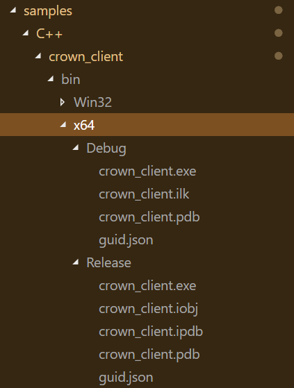
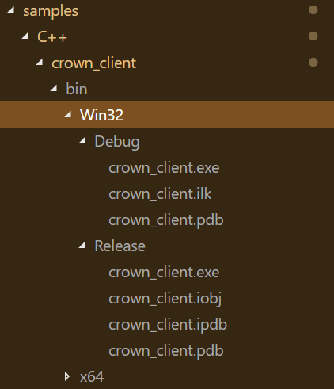
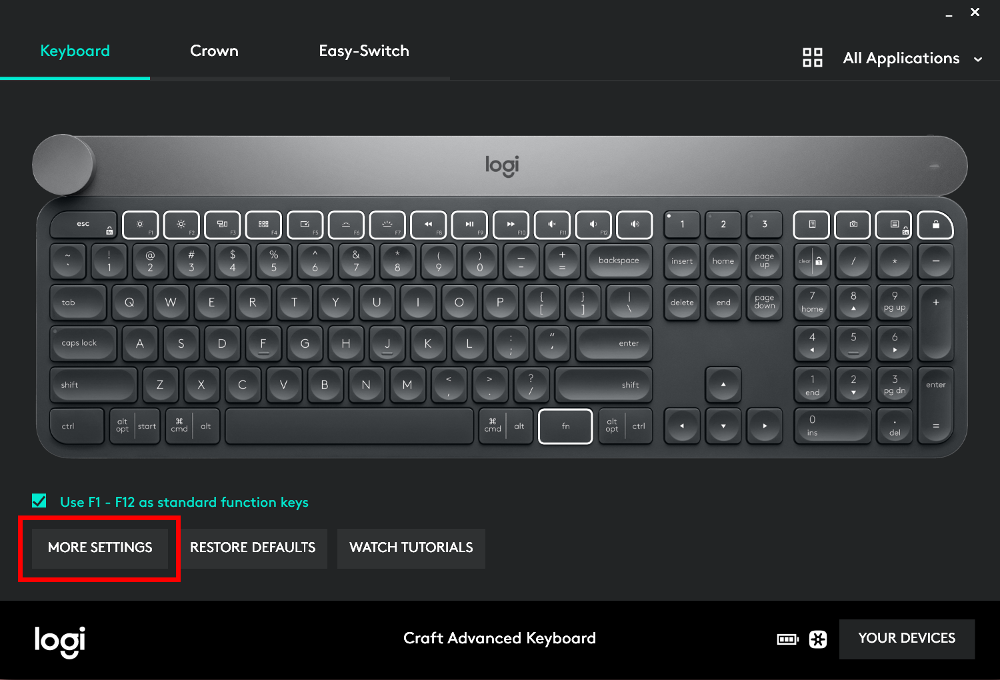
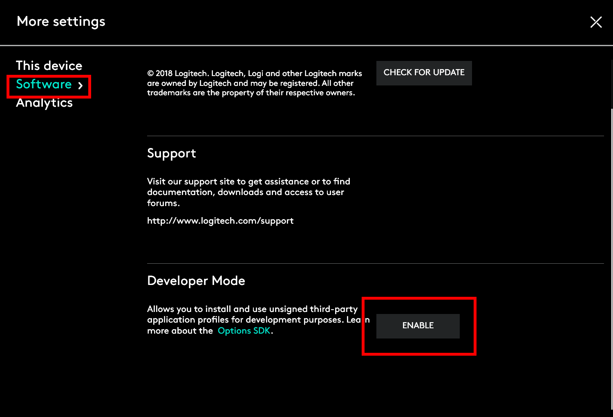
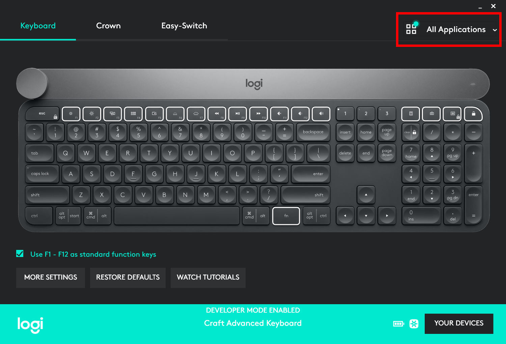
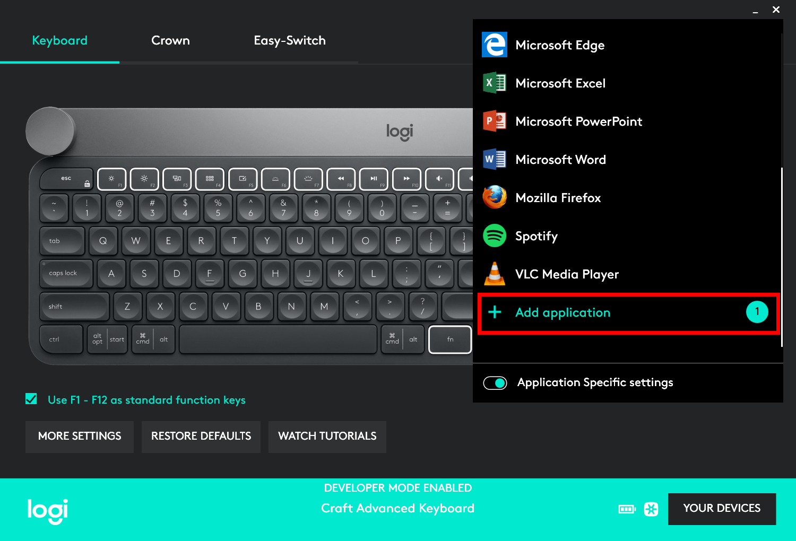
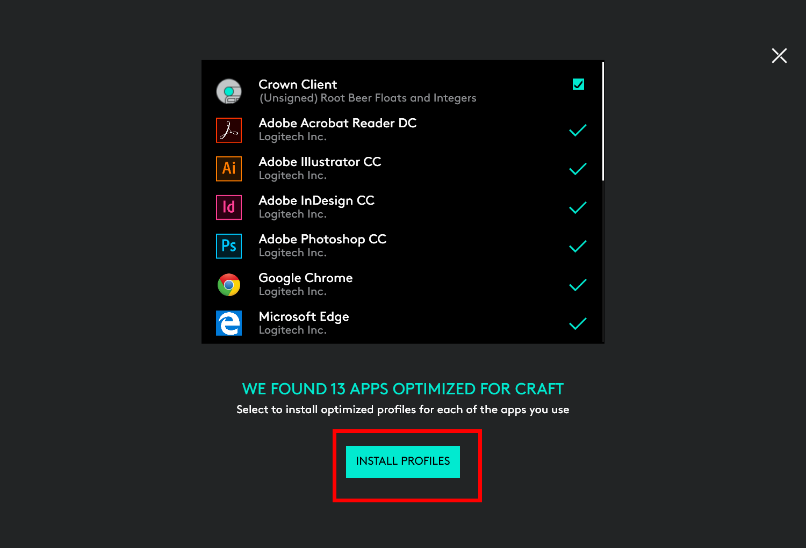
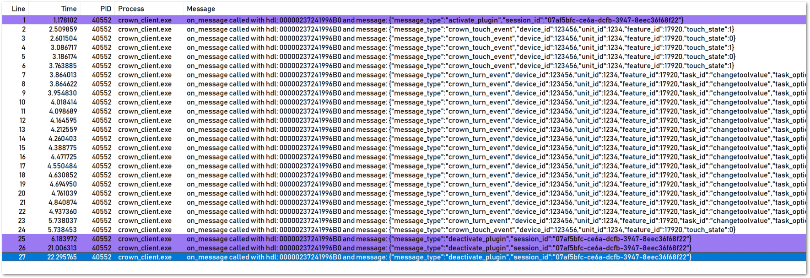

## 1. Crown Client

Crown Client is a simple console C++ sample program that demonstrates:

- Plugin registration with the Plugin Manager
- Responding to Plugin Manager messages

### 1.1 Requirements

You will need to have the following to build and use this sample code.

- Logitech Craft Keyboard <br/>
 https://www.logitech.com/product/craft <br/>


- Logitech Options 6.80, or above.
http://support.logitech.com/software/options <br/>
It must be running with Developer Mode enabled.<br/>


- Microsoft Visual Studio 2017 <br/>
It might work with older Visual Studio versions. <br/>


- python <br/>
`python` is needed to build some of the Open-source libraries. <br/>


- Software that can capture Win32 OutputDebugString messages. <br/>
 Examples include `DebugView` by Windows Sysinternals or `DebugView++` by Cobalt Fusion.
  - `DebugView`: https://docs.microsoft.com/en-us/sysinternals/downloads/debugview
  - `DebugView++`: https://github.com/CobaltFusion/DebugViewPP

---
## 2. Building Crown Client

1. Open the Visual Studio solution file `vcxproj\crown_client.sln`.
1. Select your desired build configuration and platform.
1. Select `Build` > `Build Solution`.

The build output files are under `crown_client\bin` directory under their respective platform (`Win32`,`x64`) and configuration (`Debug`,`Release`). The name of the executable is `crown_client.exe`.

 


---
## 3. Running the Crown Client

Before running `crown_client.exe` for the first time, you will need to perform these three steps:

1. Enable Logitech Options Developer Mode.
2. Copy the Crown Client plugin directory into the Logitech Options Third-party Plugins folder.
3. Create a Craft Profile from Logitech Options for Crown Client

### 3.1 Enable Logitech Options Developer Mode

From `Logitech Options` select any device (if you have multiple supported devices) and select `MORE SETTINGS`.



Go to the `Software` page and under `Developer Mode`, click the `ENABLE` button.



> You can revisit this page and click the 'DISABLE' button to turn off Developer Mode.

### 3.2 Copy the Crown Client plugin directory into the Logitech Options Third-party Plugins folder

The folder for Third-party Plugins is `%programdata%\Logishrd\LogiOptionsPlugins`. If this folder does not exist, you will need to create it yourself.

Copy the plugin folder `d4cecd7f-9eff-4428-b372-190f1126b983` found in the `resources` directory into the Logitech Options Third-party Plugins folder. Failing to do so, the Plugin Manager will refuse the connection and cause the program to quit immediately.

> The plugin folder is name after its plugin GUID `d4cecd7f-9eff-4428-b372-190f1126b983`.

You can also run the `install plugin.bat` script to copy the plugin directory, and `remove plugin.bat` to remove the plugin directory. Both script files are found in the `resources` directory.

> **`install plugin.bat`**
> ```
> mkdir "%ProgramData%\Logishrd\LogiOptionsPlugins\d4cecd7f-9eff-4428-b372-190f1126b983"
>
> xcopy "d4cecd7f-9eff-4428-b372-190f1126b983" "%ProgramData%\Logishrd\LogiOptionsPlugins\d4cecd7f-9eff-4428-b372-190f1126b983" /e /s /y
>
> ```

### 3.3 Creating a Craft Profile for Crown Client

When you run `crown_client.exe` you will notice the program is not receiving any Crown messages from the Plugin Manager. In order for the program to receive Crown messages, you will need to create a Craft profile for `Crown Client` through Logitech Options.

> Since the Crown Client plugin is unsigned, Logitech Options will not allow you to create a Craft profile unless it is running in Developer Mode.

From the Craft device page in the Logitech Options software, click `All Applications`.



Scroll down the list until you find the `Add application` selection.



Click `INSTALL PROFILES` to install the selected profiles.




The program will receive Crown messages once the profile is installed, and the program has the foreground window.

---
## 4. Crown Client Log Output

The program uses OutputDebugString to write messages received from the Plugin Manager.

The example below is taken from `DebugView++`.



---
## 5. Understanding the Crown Client Sample Plugin

### 5.1 Initialization

From the `main` function, we need to provide handlers to receive WebSocket messages, open, and close events.

```c++
// Create a client endpoint
client c;

// Register our handlers
c.set_message_handler(bind(&on_message, &c, ::_1, ::_2));
c.set_open_handler(bind(&on_open, &c, ::_1));
c.set_close_handler(bind(&on_close, &c, ::_1));
```

The Logitech Options WebSocket port for plugins is `10134`.
```c++
std::string uri = "ws://localhost:10134";
client::connection_ptr con = c.get_connection(uri, ec);
```

### 5.2 Plugin Registration

When the Crown Client plugin makes a connection with Logitech Options, the plugin will need to register itself.
The `on_open` handler takes care of this.

The plugin registration messaage is serialized in JSON format.

```c++
void on_open(client* c, websocketpp::connection_hdl hdl)
{
    // Send plugin registration message
    Json::Value json;
    json["message_type"] = "register";
    json["plugin_guid"] = guid;
    json["PID"] = (unsigned int)GetCurrentProcessId();
    json["execName"] = "crown_client.exe";
    json["application_version"] = "1.0";
}
```

> You can get more information about the plugin registration message from the [Craft Crown SDK Documentation](../../../documentation/Craft_Crown_SDK.md).

### 5.3 Responding to Event Messages

The Crown Client plugin's `on_message` handler takes care of messages received from Logitech Options. The messages are serialized in JSON format.

> Like the plugin registration message, you can get more information about the plugin messages from the [Craft Crown SDK Documentation](../../../documentation/Craft_Crown_SDK.md).

#### 5.3.1 Plugin Registration Acknowledgement

If the registration was successful, the plugin will receive an ACK reply from Logitech Options.
You need to parse this message for the `plugin session id`.

```c++
if (messageType == "register_ack")
{
  pluginSessionId = json["session_id"].asString();
  resetToolChange = true;
  return;
}
```

#### 5.3.2 Plugin Activation

Logitech Options only sends Crown messages to the plugin with the foreground window.
When a foreground window change occurs, Logitech Options sends a `activate_plugin` message if the foreground window is a registered plugin. Logitech Options sends a `deactivate_plugin` to all other registered plugins.

When the Crown Client plugin receives the `activate_plugin` message, it sends a `tool_change` message once to inform Logitech Options of the Overlay state.

```c++
if (messageType == "activate_plugin")
{
  .
  .
  .
        Json::Value json;
        json["message_type"] = "tool_change";
        json["session_id"] = pluginSessionId;
        json["tool_id"] = "slider";
        json["reset_options"] = true;
  .
  .
  .
  return;
}
```

#### 5.3.3 Crown Turn Events

When the user rotates the Crown, the Crown Client sample app receives a `crown_turn_event` message.

The Crown Client plugin parses the message ...

```c++
if (messageType == "crown_turn_event")
{
    auto ratchetDelta = json["ratchet_delta"].asInt();
    auto delta = json["delta"].asInt();
    auto currentTool = json["task_options"]["current_tool"].asString();
    auto currentToolOption = json["task_options"]["current_tool_option"].asString();

    if (currentTool != "slider")
    {
        return;
    }

    if (currentToolOption == "numbers")
    {
```

... and responds accordingly. Here it instructs Logitech Options to update the Overlay with a `tool_update` message.

```c++
// Tool Update
{
    Json::Value json;
    json["message_type"] = "tool_update";
    json["session_id"] = pluginSessionId;
    json["show_overlay"] = true;
    json["tool_id"] = currentTool;

    Json::Value toolOptions;
    toolOptions["name"] = currentToolOption;

    if (x == 11)
    {
        toolOptions["value"] = "Can't go over 11";
    }
    else if (x == -11)
    {
        toolOptions["value"] = "Too low to show";
    }
    else
    {
        toolOptions["value"] = std::to_string(x);
    }

    json["tool_options"].append(toolOptions);

    websocketpp::lib::error_code ec;
    c->send(hdl, Json::FastWriter().write(json), websocketpp::frame::opcode::value::text, ec);
    if (ec)
    {
        LOG << "Sending tool_update failed because: " << ec.message() << std::endl;
        return;
    }
}
```
