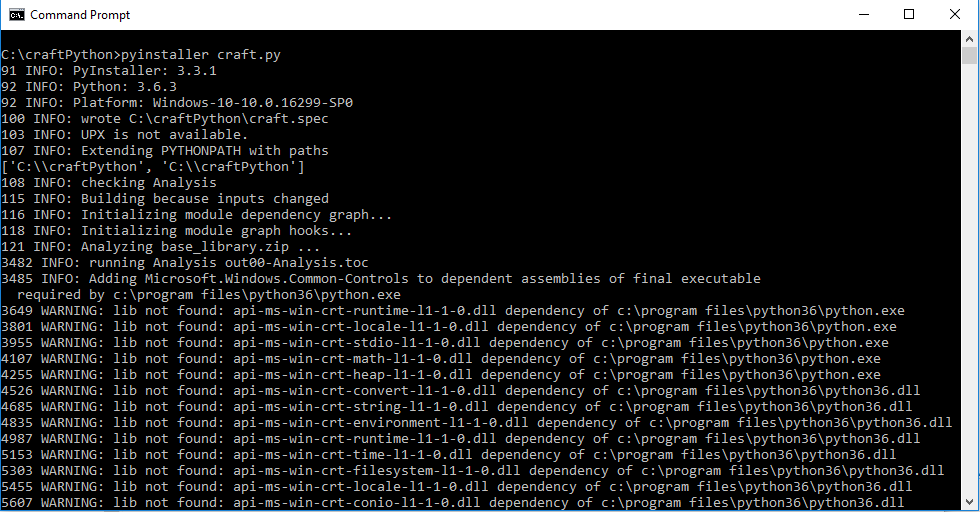

## Getting Started - Craft SDK application development using Python and WxPython

#### 1. Requirements

Logitech Craft Keyboard 

Logitech Options 6.80 or above installed.

#### 2. Setup
Install python 3.6 from the python.org

Install PyCharm edition from https://www.jetbrains.com/pycharm/download/#section=windows

In PyCharm create a new project and copy craft.py into the project

Install WxPython and websocket-client

In Command line type C:/>pip3 install wxpython

In Command line type C:/>pip3 install websocket-client

Install pyinstaller using the pip3 command 

C:\>pip3 install pyinstaller

Convert craft.py to craft.exe using the pyinstaller tool.
From the project folder run pyinstaller as shown below

pyinstaller craft.py



pyinstaller will create craft.exe in the folder /dist/craft/

Create a folder under ProgramData/Logishrd/LogiOptionsPlugins . Copy the sample manifest folder (6202f2fb-834c-4393-a95f-f5051171e3ec) into the LogiOptionsPlugins folder.


Run craft.exe from the command line.


### 3. Enable Developer Mode

Start Logitech Options and click Craft Advanced Keboard image


Click on MORE SETTINGS


Click Software tab and click ENABLE button from Developer Mode panel.


Next, Click "All Applications" You will see list of application detected by the Logitech Options.


Click "Add application"


Select your sample application and click "INSTALL PROFILES".


Confirm and click "INSTALL PROFILES"


Click CONTINUE button


Confirm that profile has been enabled for you sample applicaiton.


Now switch to your sample Craft application and use crown to adjust your app's controls.
#### 4. Deployment scenario

If want to deploy your plugins to other Logitech Options Craft users, you will need to contact Logitech at craftSDK@logitech.com more information.


Below steps are for new manifest file creation

### 5. GUID creation

Create a GUID (Globally Unique Identifier) using a online GUID generator. Create a folder in the same name as the GUID as shown below. And create 3 folders (Gallery, Languages and Manifest)


### 6. Manifest folder creation

Create 2 files in the Manifest folder (defaults.json, tools.json)

defaults.json

```json
{
    "GUID": "6202f2fb-834c-4393-a95f-f5051171e3ec",
    "info": {
        "name": "Craft Python SDK App",
         "publisher": "Logitech Inc.",
        "version": "1.0",
        "win_name": "craft.exe",
        
        "mac_bundle": "",
        "mac_path": "",
        "mac_paths": [
            {
                "path": "",
                "mac_minimum_supported_version": "",
                "mac_maximum_supported_version": "",
                "name_suffix": ""
            },
            {
                "path": "",
                "comment": "",
                "mac_minimum_supported_version": "",
                "mac_maximum_supported_version": "",
                "name_suffix": ""
            }
        ],
        "win_minimum_supported_version": "0.0.0",
        "win_maximum_supported_version": "2017.0.1"
    },
    "crown": {
        "rotate": {
            "default_task": "changetoolvalue",
            "tasks": [
                "changetoolvalue"
            ],
            "short_list": [
                "changetoolvalue"
            ]
        },
        "press": {
            "default_task": "playpause",
            "tasks": [
                "playpause"
            ],
            "short_list": [
                "playpause"
            ]
        }
    }
}
```

Change the GUID key to the online generated value. Change the name, publisher, version and win_name as shown in the figure.

tools.json

```json
{
    "GUID": "6202f2fb-834c-4393-a95f-f5051171e3ec",
    "tools": [     
        {
            "name": "Slider",
            "enabled": true,
            "tool_options": [
                {
                    "index": 0,
                    "name": "slider",
                    "image_file_path": "horizontal.png",
                    "enabled": true,
                    "ratchet_enabled": false
                }
            ]
        },
        {
            "name": "SpinCtrl",
            "enabled": true,
            "tool_options": [
                {
                    "index": 0,
                    "name": "spinCtrl",
                    "image_file_path": "numericUpDown.png",
                    "enabled": true,
                    "ratchet_enabled": false
                }
            ]
        },
        {
            "name": "Gauge",
            "enabled": true,
            "tool_options": [
                {
                    "index": 0,
                    "name": "gauge",
                    "image_file_path": "progressBar.png",
                    "enabled": true,
                    "ratchet_enabled": false
                }
            ]
        },
```

Create a tools.json file and add the GUID in the top of the file as shown above. Add other information and name is the name of the control that craft need to control. image_file_path is the image file that is shown in the overlay. ratchet_enabled controls the ratchet or freewheel mode.

### 7. Languages folder
Create a file called en.json for english version. The LocalizedStrings contain the ID and value key. ID corresponds to the name in the tool_options in the tools.json.

```json
{
    "LocalizedStrings": [
        {
            "ID": "slider",
            "value": "Slider"
        },
        {
            "ID": "spinCtrl",
            "value": "SpinCtrl"
        },
        {
            "ID": "gauge",
            "value": "Gauge"
        },
        {
            "ID": "textCtrl",
            "value": "TextCtrl"
        },
        {
            "ID": "comboBox",
            "value": "ComboBox"
        },
        {
            "ID": "checkedListBox",
            "value": "Checked List Box"
        },
```

### 8. Gallery folder
Create a Gallery folder and copy all the image files that are referenced in the tools.json.


### 9. Craft Connection
Application connect with the Craft on port 10134 using websocket. Then on_open gets called, which register with the craft.

```python
def connect(self, execName,manifestFilePath):
    print("connect called...")
    global ws
    self.executableName = execName
    self.manifestPath = manifestFilePath

    websocket.enableTrace(True)

    ws = websocket.WebSocketApp("ws://127.0.0.1:10134",
                                 on_open = self.on_open,
                                 on_message = self.on_message,
                                 on_close = self.on_close)


    wst = threading.Thread(target=ws.run_forever)
    wst.daemon = True
    wst.start()

```

### 10. Craft Registration

```python
def on_open(self,ws):
    print("on_open called...")
    uid = "6202f2fb-834c-4393-a95f-f5051171e3ec"
    pid = os.getpid()

    connectMessage = {
            "message_type": "register",
            "plugin_guid": "6202f2fb-834c-4393-a95f-f5051171e3ec",
            "PID": pid,
            "execName": self.executableName,
            "manifestPath": self.manifestPath
        }

    regMsg =  json.dumps(connectMessage)
    ws.send(regMsg.encode('utf8'))

```

### 11. Craft Messages

Craft turn and touch messages are collected in the on_message routine.

```python
def on_message(self,ws, message):
    print("on_message called...")
    # craft events come in as json objects
    craftEventObj = json.loads(message)
    self.wrapperUpdateUI(craftEventObj)
```

### 12. UI Handler

WxPython GUI toolkit was used in this application

```python
def __init__(self, parent, id):
    global craft,slider,spin,gauge,combo,txt,lb
    wx.Frame.__init__(self, parent, id,"Craft Python SDK Sample", size=(800,400))
    panel = wx.Panel(self)
    #lbl = wx.StaticText(panel,-1,"Slider",(10,20))
    lbl = wx.StaticText(panel,-1,label="text",pos=(10,20),size=(50,-1))
    lbl.SetLabel("Slider")

    slider=wx.Slider(panel,-1,0,1,1000,(100,20),(200,-1))
    slider.Bind(wx.EVT_LEFT_UP, self.onClick)

    lbl = wx.StaticText(panel,-1,label="text",pos=(10,100),size=(50,-1))
    lbl.SetLabel("SpinCtrl")

    spin = wx.SpinCtrl(panel,-1,"",pos=(100,100),size=(200,-1),min=0,max=1000)
    spin.Bind(wx.EVT_LEFT_UP, self.spinCtrlClick)

    lbl = wx.StaticText(panel,-1,label="text",pos=(10,180),size=(50,-1))
    lbl.SetLabel("Gauge")

    gauge = wx.Gauge(panel, -1, range=500,pos=(100,180),size=(200,25))
    gauge.Bind(wx.EVT_LEFT_UP, self.gaugeClick)

    lbl = wx.StaticText(panel,-1,label="text",pos=(10,260),size=(50,-1))
    lbl.SetLabel("ComboBox")

    l=[]
    for i in range(0,1000):
        l.append(str(i))
    combo = wx.ComboBox(panel, -1, "",pos=(100,260), size=(200,25), choices=l)
    combo.Bind(wx.EVT_LEFT_UP, self.comboBoxClick)

    lbl = wx.StaticText(panel,-1,label="text",pos=(400,20),size=(50,-1))
    lbl.SetLabel("TextCtrl")

    vtxt = "This is text.This is text.This is text.This is text.This is text.This is text."
    txt = wx.TextCtrl(panel, -1, vtxt, pos=(480,20),size=(100,-1))
    txt.Bind(wx.EVT_LEFT_UP, self.textCtrlClick)

    lbl = wx.StaticText(panel,-1,label="text",pos=(400,180),size=(50,-1))
    lbl.SetLabel("ListBox")

    li =[]
    for i in range(0,1000):
        li.append(str(i))

    lb = wx.ListBox(panel, -1, pos=(480,180),size=(100,-1),choices=li)
    lb.Bind(wx.EVT_LEFT_UP, self.listBoxClick)
```

TextFrame was created using the wx.Frame function and panel object was created by passing the Frame object as a parent in the wx.Panel argument. All other components are added to the panel object. For example, StaticText and Slider controls were added to the panel.

```python
li =[]
for i in range(0,1000):
    li.append(str(i))

lb = wx.ListBox(panel, -1, pos=(480,180),size=(100,-1),choices=li)
lb.Bind(wx.EVT_LEFT_UP, self.listBoxClick)

```

ListBox is added to the panel by passing panel object as the parent, position, size and choices. Choices are the list of objects to be added to the listbox.

### 13. Click event attached to controls

```python
def listBoxClick(self, event):
    print("ListBox clicked...",sessionId)
    connectMessage = {
            "message_type": "tool_change",
            "session_id": sessionId,
            "tool_id": "ListBox"
        }
    regMsg =  json.dumps(connectMessage)
    ws.send(regMsg.encode('utf8'))
    event.Skip()

```

All controls are attached to the event using the Bind function. Mouse click on the ListBox will call the listBoxClick function. The listBoxClick function creates a connectMessage json object with the following parameters message_type, session_id and tool_id and sends this json object to the craft using the websocket send command.

### 14. Craft turn event handler

```python
if(msg['message_type'] == "crown_turn_event"):
    glist.append(msg)
    listCount = len(glist)
    if listCount==0:
        return
    currentToolOption = glist[0]['task_options']['current_tool_option']
    print("+++currentToolOption = ",currentToolOption)
    print("listCount = ",listCount)
    firstObject = glist[0]
    for i in range(listCount):
        if currentToolOption == glist[i]['task_options']['current_tool_option']:
            totalDeltaValue = totalDeltaValue = glist[i]['delta']
            totalRatchetDeltaValue = totalRatchetDeltaValue + glist[i]['ratchet_delta']
        else:
            break
        count += 1

    if listCount >= 0:
        glist.clear()
    print("totalDeltaValue = ",totalDeltaValue)
    print("firstObject = ",firstObject['message_type'])
    if firstObject['message_type'] == "deactivate_plugin":
        return
```

All turn event of the craft are added to the glist and total delta value is calculated as shown in the above figure.

### 15. Slider control

```python
try:
    if firstObject['message_type'] == "crown_turn_event":
        print("turn event =====")
        if firstObject['task_options']['current_tool'] == 'Slider':
            print("\n","selected slider")
            v = slider.GetValue()
            tvalue = v + totalDeltaValue
            slider.SetValue(tvalue)
        elif firstObject['task_options']['current_tool'] == 'SpinCtrl':
            print("\n","selected SpinCtrl")
            v = spin.GetValue()
            tvalue = v + totalDeltaValue
            spin.SetValue(tvalue)
        elif firstObject['task_options']['current_tool'] == 'Gauge':
            print("\n","selected Gauge")
            v = gauge.GetValue()
            tvalue = v + totalDeltaValue
            gauge.SetValue(tvalue)
```

If the craft message type is crown_turn_event then delta value is applied for that tool.

### 16. Main Loop

```python
if __name__ == '__main__':
    global ws
    global craft

    app = wx.App()
    frame = TestFrame(parent=None, id=-1)
    frame.Show()

    craft = CraftClient()
    craft.connect("Craft.exe", "")


app.MainLoop()

```

Above code starts the application by creating the wx.App() object of WxPython for GUI and craftClient which interact with the Craft.