## Getting Started - Craft SDK application development using Python and wxPython

### 1. Requirements

**Logitech Craft Keyboard (hardware)** <br/>
https://www.logitech.com/product/craft

**Logitech Options 6.80 and above (software)** <br/>
http://support.logitech.com/software/options

### 2. Setup

#### 2.1. Install python 3.6
https://www.python.org/

#### 2.2 Install wxPython and websocket-client

Install `wxPython` from the command line: <br/>
```
pip3 install wxpython
```

Install `websocket-client` from command line: <br/>
```
pip3 install websocket-client
```

Install `pyinstaller` from the command line: <br/>
```
pip3 install pyinstaller
```

#### 2.3 Create an Windows executable or macOS bundle

You will need to use `pyinstaller` to create a Windows executable or a macOS bundle.

**Windows:** <br/>
```
pyinstaller craft.py
```

---
**macOS:** <br/>
Convert `craft.py` to `craft.app` using the `pyinstaller` tool:
```
pyinstaller -windowed craft.py
```

#### 2.4 Copy to plugins folder

**Windows:** <br/>
Create a folder in Windows as shown in the figure. `(ProgramData/Logishrd/LogiOptionsPlugins)`.
Copy the sample manifest folder `6202f2fb-834c-4393-a95f-f5051171e3ec` into the `LogiOptionsPlugins` folder.

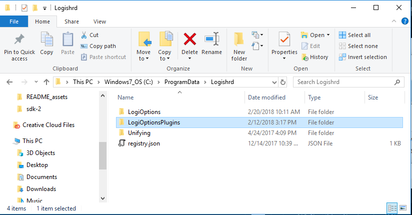

---
**macOS:** <br/>
Open the file `6202f2fb-834c-4393-a95f-f5051171e3ec/Manifest/defaults.json` from your text editor and:

1. replace the string `<-- full path of the folder that contains the craft.app bundle here -->` with the folder path of `./dist`.

2. replace the string `<-- full path of craft.app bundle here -->` with the full path of `./dist/craft.app`.

Create the folder `~/Library/Application\ Support/Logitech/Logitech\ Options/Plugins` and copy the sample manifest folder `6202f2fb-834c-4393-a95f-f5051171e3ec` into the `Plugins` folder.

#### 2.5 Run the sample program

**Windows:** <br/>
Run `craft.exe` from the command line.

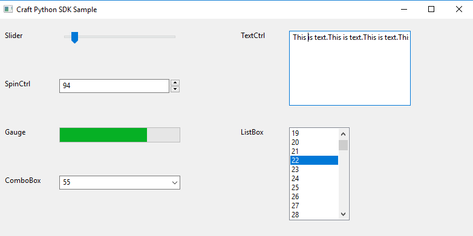

**macOS:** <br/>
Run `craft.app` from `Finder`, or enter `open dist/craft.app` from the command line.


### 3. Enable Developer Mode

Start **Logitech Options** and click **Craft Advanced Keyboard**.

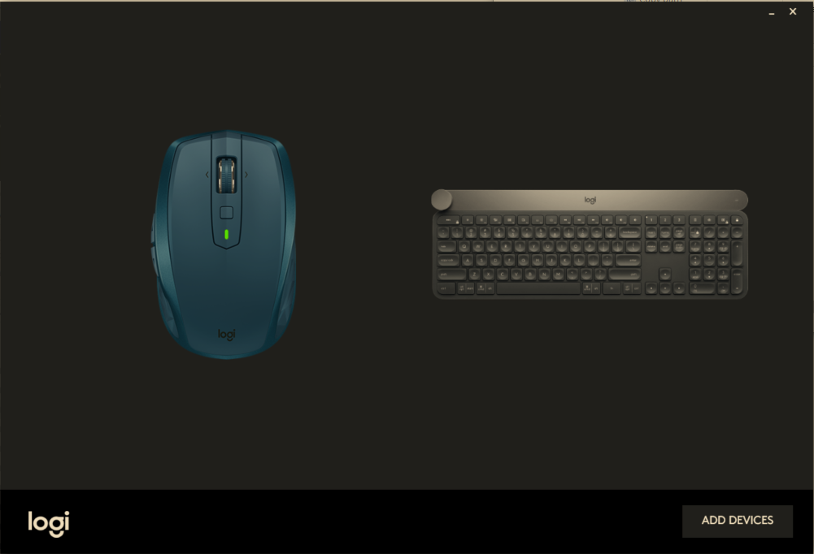

Click `MORE SETTINGS`.

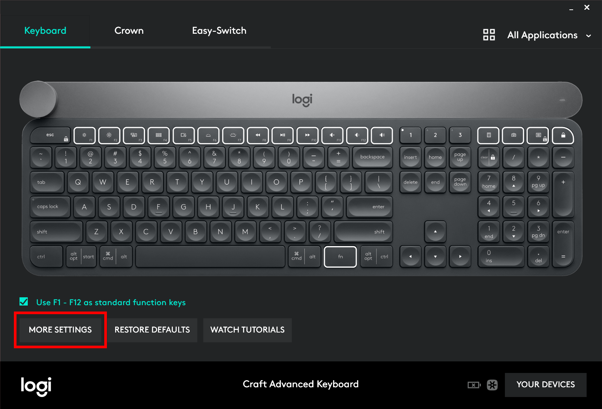

Click `ENABLE` button from the **Developer Mode** section.

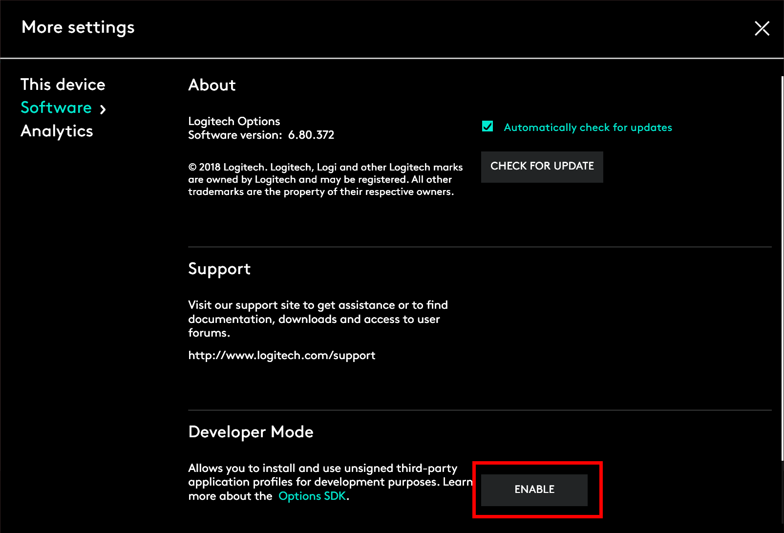

Click `All Applications` in the top of the panel and scroll down to `Add application`. You should see a round icon with the number of applications with a supported plugin.

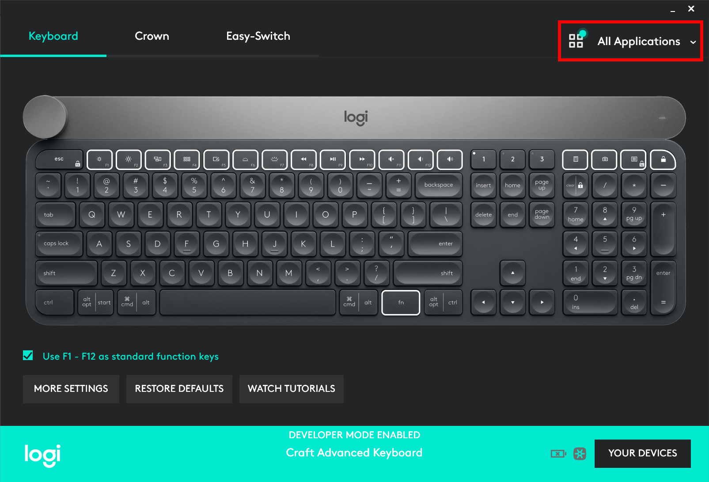

Click `All Applications` and click round icon next to `Add application`.

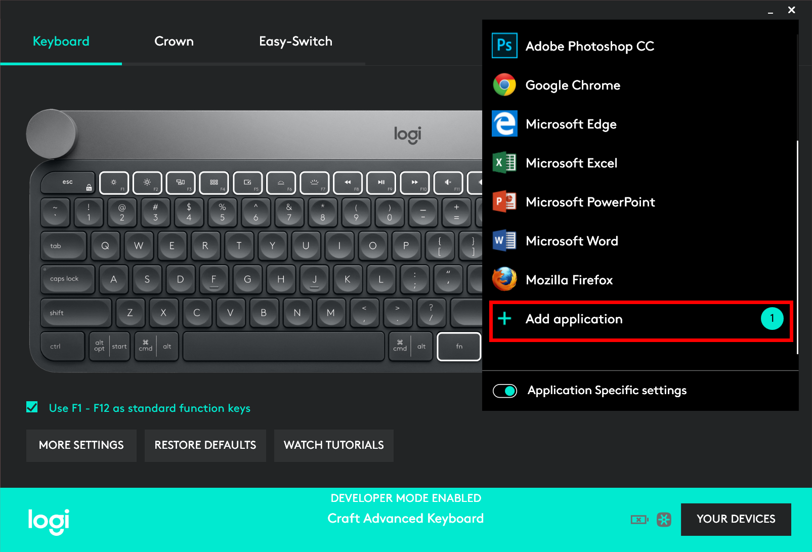

Click `INSTALL PROFILES` to install applications to the Logitech Options.

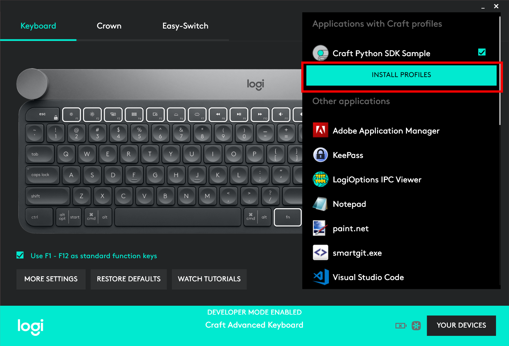

Application added to the list for installation and click `INSTALL PROFILES`.

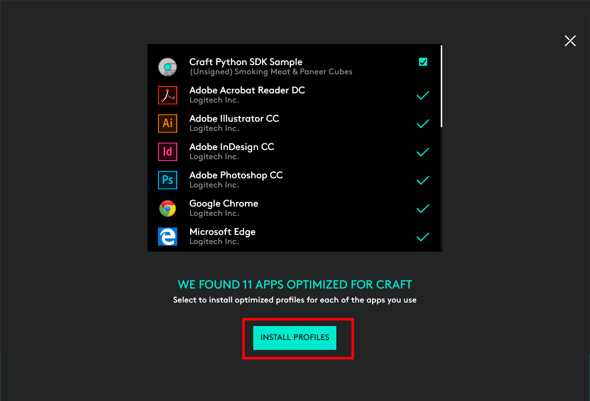

Click `CONTINUE` button.


Applications added to the Logitech Options.

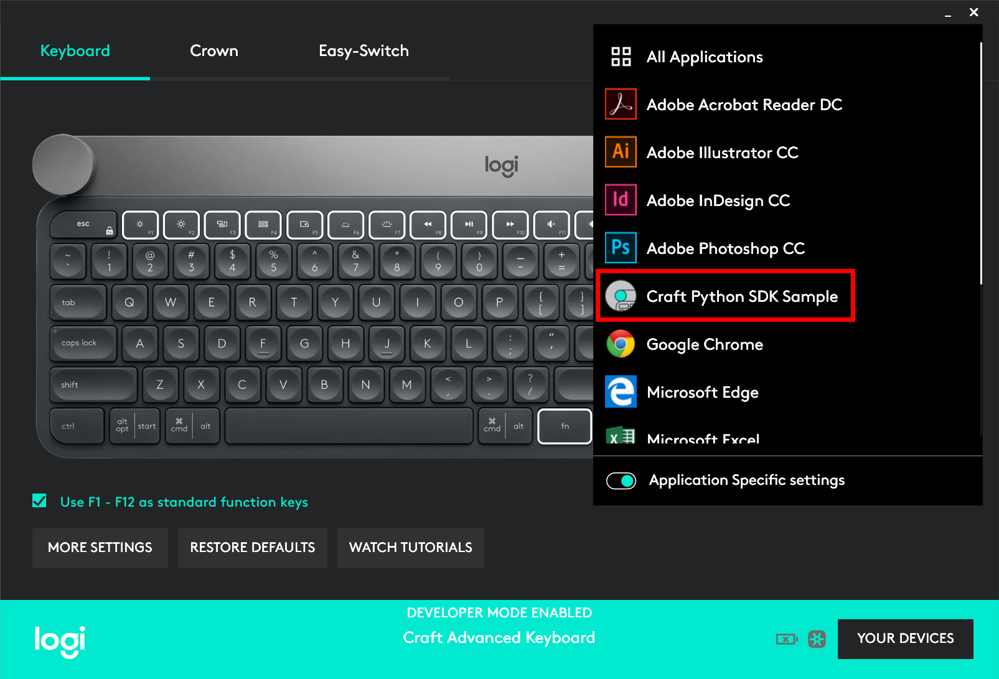

By starting the Craft application, user can click the controls to get the context and then able to turn the Crown in the Craft for interaction with various controls in the application.

### 4. Deployment scenario

Contact Logitech at `craftSDK[at]logitech[dot]com` for signing and whitelisting of your application plugin so that it works even in non-developer mode.

Below steps are for new manifest file creation

### 5. GUID creation

Create a GUID (Globally Unique Identifier) using an online GUID generator. Create a folder in the same name as the GUID as shown below. And create 3 folders (Gallery, Languages and Manifest)


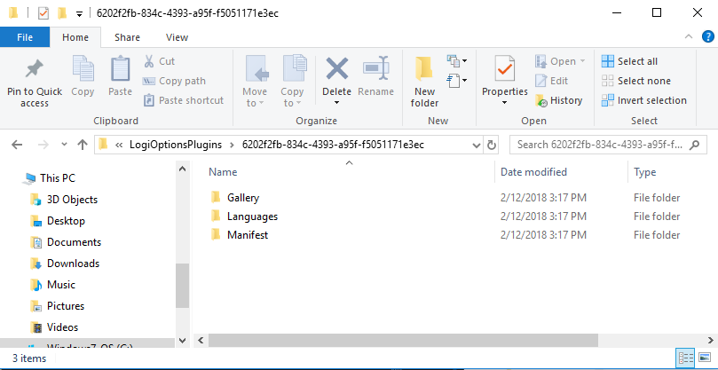

### 6. Manifest folder creation

Create 2 files in the Manifest folder (`defaults.json`, `tools.json`)

**defaults.json**
```json
{
    "GUID": "6202f2fb-834c-4393-a95f-f5051171e3ec",
    "info": {
        "name": "Craft Python SDK Sample",
        "publisher": "Logitech Inc.",
        "version": "1.0",
        "win_name": "craft.exe",
        "win_minimum_supported_version": "0.0.0",
        "win_maximum_supported_version": "2017.0.1",
        "mac_bundle": "craft.app",
        "mac_path": "<-- folder path of craft.app here -->",
        "mac_paths": [
            {
                "path": "<-- full path of craft.app here -->",
                "mac_minimum_supported_version": "0.0.0",
                "mac_maximum_supported_version": "10.0.0",
                "name_suffix": ""
            }
        ]
    },
    "crown": {
        "rotate": {
            "default_task": "changetoolvalue",
            "tasks": [
                "changetoolvalue"
            ],
            "short_list": [
                "changetoolvalue"
            ]
        },
        "press": {
            "default_task": "playpause",
            "tasks": [
                "playpause"
            ],
            "short_list": [
                "playpause"
            ]
        }
    }
}
```

Change the GUID key to the online generated value. Change the name, publisher, version and win_name as shown in the figure.

**tools.json**
```json
{
    "GUID": "6202f2fb-834c-4393-a95f-f5051171e3ec",
    "tools": [
		{
            "name": "Slider",
            "enabled": true,
            "tool_options": [
                {
                    "index": 0,
                    "name": "slider",
                    "image_file_path": "horizontal.png",
                    "enabled": true,
                    "ratchet_enabled": false
                }
            ]
        },
        {
            "name": "SpinCtrl",
            "enabled": true,
            "tool_options": [
                {
                    "index": 0,
                    "name": "spinCtrl",
                    "image_file_path": "numericUpDown.png",
                    "enabled": true,
                    "ratchet_enabled": false
                }
            ]
        },
		{
            "name": "Gauge",
            "enabled": true,
            "tool_options": [
                {
                    "index": 0,
                    "name": "gauge",
                    "image_file_path": "progressBar.png",
                    "enabled": true,
                    "ratchet_enabled": false
                },
				{
                    "index": 1,
                    "name": "gaugeRatchet",
                    "image_file_path": "progressBar.png",
                    "enabled": true,
                    "ratchet_enabled": true
                }
            ]
        }
        .
        .
        .
    ]
}
```

Create a `tools.json` file and add the GUID in the top of the file as shown above. Add other information and name is the name of the control that Craft need to control. `image_file_path` is the image file that is shown in the overlay. ratchet_enabled controls the ratchet or freewheel mode.

### 7. Languages folder
Create a file called `en.json` for English version. The LocalizedStrings contain the ID and value key. ID corresponds to the name in the tool_options in the `tools.json`.

```json
{
    "LocalizedStrings": [
        {
            "ID": "slider",
            "value": "Slider"
        },
		{
            "ID": "spinCtrl",
            "value": "SpinCtrl"
        },
        {
            "ID": "gauge",
            "value": "Gauge"
        },
        {
            "ID": "textCtrl",
            "value": "TextCtrl"
        }
        .
        .
        .
```

### 8. Gallery folder
Create a Gallery folder and copy all the image files that are referenced in the `tools.json`.

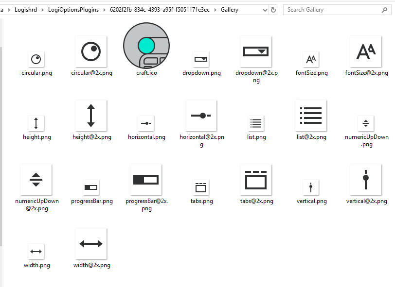

### 9. Craft Connection
Application connect with the Craft on port 10134 using websocket. Then on_open gets called, which register with the Craft.

```python
def connect(self, execName,manifestFilePath):
    print("connect called...")
    global ws
    self.executableName = execName
    self.manifestPath = manifestFilePath

    websocket.enableTrace(True)

    ws = websocket.WebSocketApp("ws://127.0.0.1:10134",
                                on_open = self.on_open,
                                on_message = self.on_message,
                                on_close = self.on_close)


    wst = threading.Thread(target=ws.run_forever)
    wst.daemon = True
    wst.start()
```

### 10. Craft Registration

```python
def on_open(self,ws):
    print("on_open called...")
    uid = "6202f2fb-834c-4393-a95f-f5051171e3ec"
    pid = os.getpid()

    connectMessage = {
        "message_type": "register",
        "plugin_guid": uid,
        "PID": pid,
        "execName": self.executableName,
        "manifestPath": self.manifestPath,
        "application_version": "0.0.0"
    }

    regMsg =  json.dumps(connectMessage)
    ws.send(regMsg.encode('utf8'))
```

### 11. Craft Messages

Craft turn and touch messages are collected in the on_message routine.

```python
def on_message(self,ws, message):
    print("on_message called...")
    # craft events come in as json objects
    craftEventObj = json.loads(message)
    wx.CallAfter(self.wrapperUpdateUI, craftEventObj)
```

### 12. UI Handler

`wxPython` GUI toolkit was used in this application

```python
def __init__(self, parent, id):
    global craft,slider,spin,gauge,combo,txt,lb

    wx.Frame.__init__(self, parent, id, "Craft Python SDK Sample", size=(800,400))

    panel = wx.Panel(self)

    lbl = wx.StaticText(panel,-1, label="text", pos=(10,20), size=(50,-1))
    lbl.SetLabel("Slider")

    slider=wx.Slider(panel, -1, 0, 1, 1000, (100,20), (200,-1))
    slider.Bind(wx.EVT_SET_FOCUS, self.sliderFocus)
    slider.Bind(wx.EVT_LEFT_UP, self.sliderFocus)

.
.
.

    lbl = wx.StaticText(panel, -1, label="text", pos=(400,180), size=(50,-1))
    lbl.SetLabel("ListBox")

    li =[]
    for i in range(0, 1000):
        li.append(str(i))

    lb = wx.ListBox(panel, -1, pos=(480,180), size=(100,-1), choices=li)
    lb.Bind(wx.EVT_SET_FOCUS, self.listBoxFocus)
    lb.Bind(wx.EVT_LEFT_UP, self.listBoxFocus)
```

`TextFrame` was created using the `wx.Frame` function and panel object was created by passing the Frame object as a parent in the `wx.Panel` argument. All other components are added to the panel object. For example, `StaticText` and `Slider` controls were added to the panel.

```python
li =[]
for i in range(0, 1000):
    li.append(str(i))

lb = wx.ListBox(panel, -1, pos=(480,180), size=(100,-1), choices=li)
lb.Bind(wx.EVT_SET_FOCUS, self.listBoxFocus)
lb.Bind(wx.EVT_LEFT_UP, self.listBoxFocus)
```

`ListBox` is added to the panel by passing panel object as the parent, position, size and choices. Choices are the list of objects to be added to the listbox.

### 13. Click event attached to controls

```python
def listBoxFocus(self, event):
    print("ListBox receives focus")
    self.changeTool("ListBox")
    event.Skip()
```

```python
def changeTool(self, name):
    connectMessage = {
        "message_type": "tool_change",
        "session_id": sessionId,
        "tool_id": name
    }
    regMsg =  json.dumps(connectMessage)
    ws.send(regMsg.encode('utf8'))
```

All controls are attached to the event using the Bind function. Mouse clicking or setting focus on the `ListBox` will call the `listBoxFocus` function. The `listBoxFocus` function creates a `connectMessage` json object with the following parameters `message_type`, `session_id`, and `tool_id` and sends this json object to the Craft using the websocket send command.

### 14. Craft turn event handler

```python
if(msg['message_type'] == "crown_turn_event"):
    glist.append(msg)
    listCount = len(glist)
    if listCount==0:
        return
    currentToolOption = glist[0]['task_options']['current_tool_option']
    print("+++currentToolOption = ",currentToolOption)
    print("listCount = ",listCount)
    firstObject = glist[0]
    for i in range(listCount):
        if currentToolOption == glist[i]['task_options']['current_tool_option']:
            totalDeltaValue = totalDeltaValue = glist[i]['delta']
            totalRatchetDeltaValue = totalRatchetDeltaValue + glist[i]['ratchet_delta']
        else:
            break
        count += 1

    if listCount >= 0:
        glist.clear()
    print("totalDeltaValue = ",totalDeltaValue)
    print("firstObject = ",firstObject['message_type'])
    if firstObject['message_type'] == "deactivate_plugin":
        return
```

All turn event of the Craft are added to the glist and total delta value is calculated as shown in the above figure.

### 15. Slider control

```python
try:
    if firstObject['message_type'] == "crown_turn_event":
        print("turn event =====")
        if firstObject['task_options']['current_tool'] == 'Slider':
            print("\n","selected slider")
            v = slider.GetValue()
            tvalue = v + totalDeltaValue
            slider.SetValue(tvalue)
        elif firstObject['task_options']['current_tool'] == 'SpinCtrl':
            print("\n","selected SpinCtrl")
            v = spin.GetValue()
            tvalue = v + totalDeltaValue
            spin.SetValue(tvalue)
        elif firstObject['task_options']['current_tool'] == 'Gauge':
            print("\n","selected Gauge")
            v = gauge.GetValue()
            tvalue = v + totalDeltaValue
            gauge.SetValue(tvalue)
```

If the Craft message type is `crown_turn_event` then delta value is applied for that tool.

### 16. Main Loop

```python
if __name__ == '__main__':
    global ws
    global craft

    app = wx.App()
    frame = TestFrame(parent=None, id=-1)
    frame.Show()

    craft = CraftClient()

    if platform.system() == 'Windows':
        craft.connect("Craft.exe", "")
    else:
        craft.connect("craft.app", "")

app.MainLoop()
```

Above code starts the application by creating the `wx.App()` object of `wxPython` for GUI and CraftClient which interact with the Craft keyboard.