# About

This repo consists of  
* Xcode project that builds the Craft Objective-c framework. 
* crafttest cocoa application plugin example for mac os.
* sample plugin manifest, resources under folder 36f0bda7-7562-4c58-8a25-ddb00e9ebabd.

# Requirements

1. Logitech Craft Keyboard (hardware)
   https://www.logitech.com/en-us/product/craft
   or its localized version.

2. Logitech Options 6.80 and above (software)
   http://support.logitech.com/en_us/software/options
   or its localized version must be installed.

3. Xcode 8.3.3 or Xcode 9.1 
   (Older version than Xcode 8.3.3 may not work.)
   https://developer.apple.com/download/more/?name=Xcode

4. Mac OS 10.11 and above 
   Required by Logitech Options.

# Dependencies

Craft SDK relies upon https://github.com/facebook/SocketRocket for its WebSocket communication layer.
Note: For deployment SocketRocket.framework should be available in Framework Search path (typically /Library/Frameworks)

# Building the SDK and sample application

To build SDK and example

#### Dependency installation 
1. From the terminal cd into the folder where you have cloned this repo, run "pod install"  (Hint: your pwd should have a Podfile)
   Note:if pod command is not found, install cocoapods from www.cocoapods.org.

#### Xcode setup	
1. Open Craft.xcworkspace file with xcode (**Note:** Open .xcworkspace not .xcodeproj).
2. Make sure the build artifacts are going to the "Legacy" location. The project settings must be setup as shown below. 
   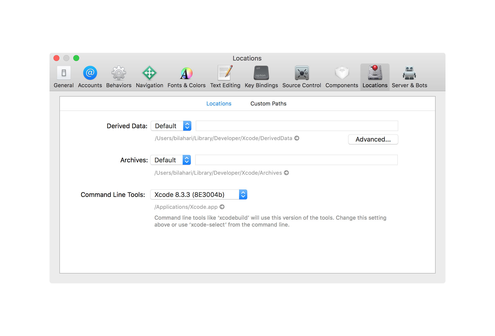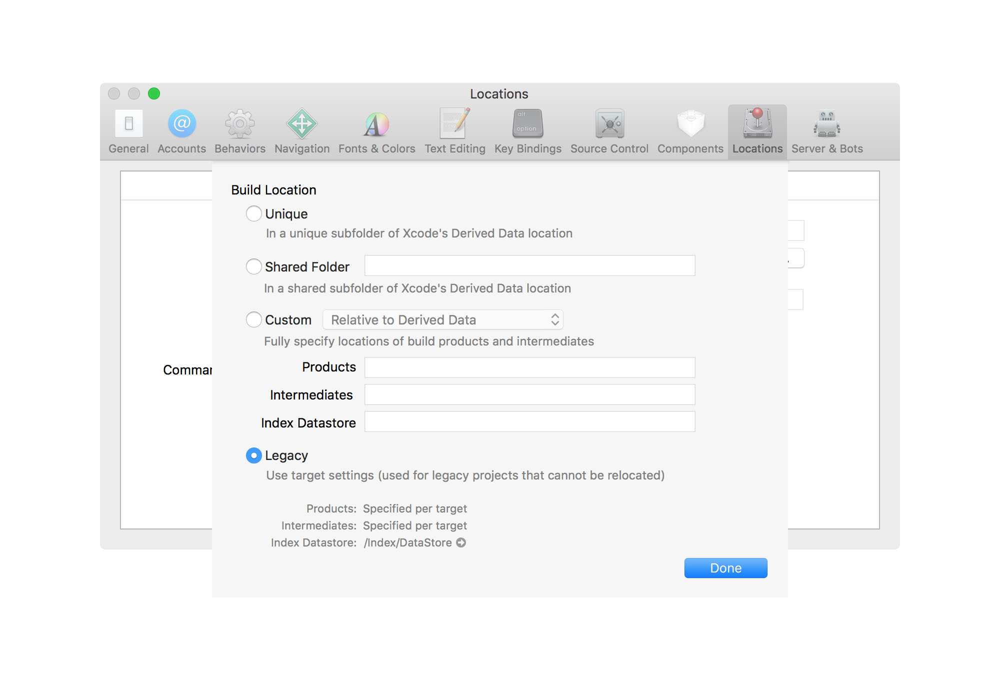
3. You will see 2 build targets. Build "Craft" target to get Craft.framework which encapsulates the
   is the sdk.
4. Also build the cocoa UI app example in target "crafttest". This will generate craftest.app.

#### Plugin resources and preparation 
1. Make sure you have installed Logitech Options.app first before performing any of the below steps.
2. Double check that you have a ~/Library/Application Support/Logitech/Logitech Options/Plugins/ folder.
3. In the "36f0bda7-7562-4c58-8a25-ddb00e9ebabd" folder provided in this repo,  modify
   36f0bda7-7562-4c58-8a25-ddb00e9ebabd/Manifest/defaults.json, 
  make sure to specify the path to parent folder of your sample application in mac_path field and absolute path to the app bundle in mac_paths field.
       Check below for example 
       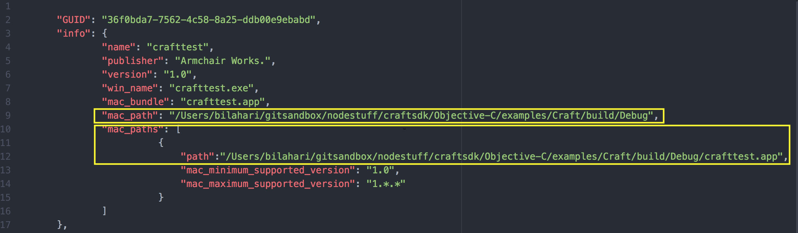
  **Note:Make sure you have saved the defaults.json after making changes to mac_path, mac_paths fields.**
4. The other important file you need to know about in Plugin resources is tools.json. 
   Open tools.json located at  36f0bda7-7562-4c58-8a25-ddb00e9ebabd/Manifest/tools.json to see what tools and tool options
   are supported in this sample application. You will notice that "slider" tool with 3 options and "image" tool with 2 options
   are currently supported. tools.json is the file where you will put all the tools and tool options for which your application 
   will support and implement craft crown integration.

#### Logi Options : Developer mode setup
1. Enable developer mode and create a profile for craftest.app so that the app gets registered as an eligible application
   for receiving craft crown events.
2. For enabling developer mode, click on "More Settings" button
       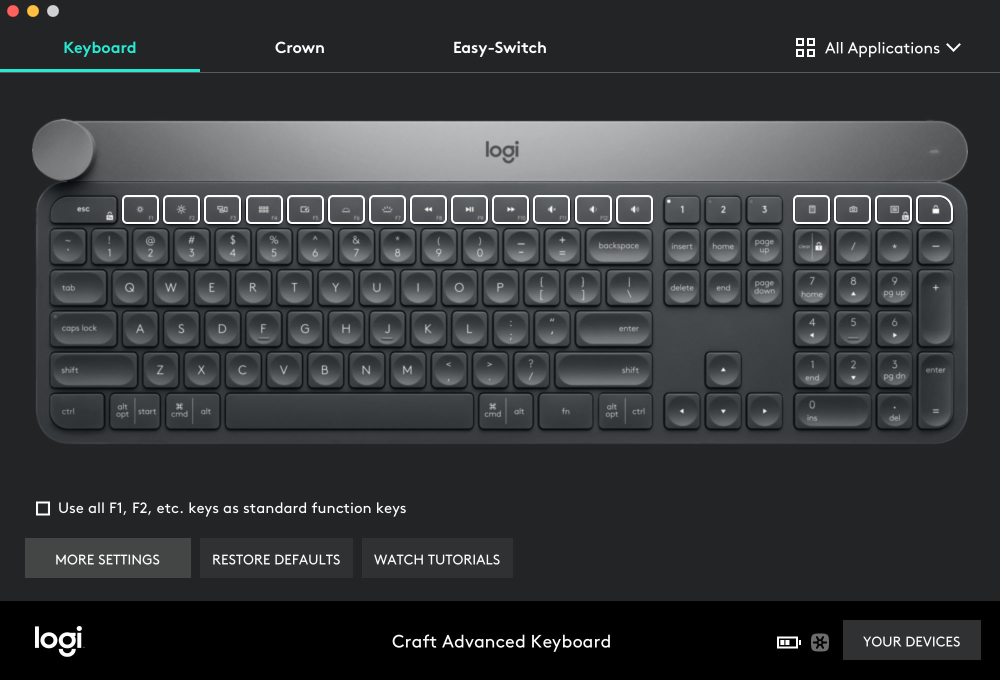
       Go to "Software" tab and Enable developer mode.
       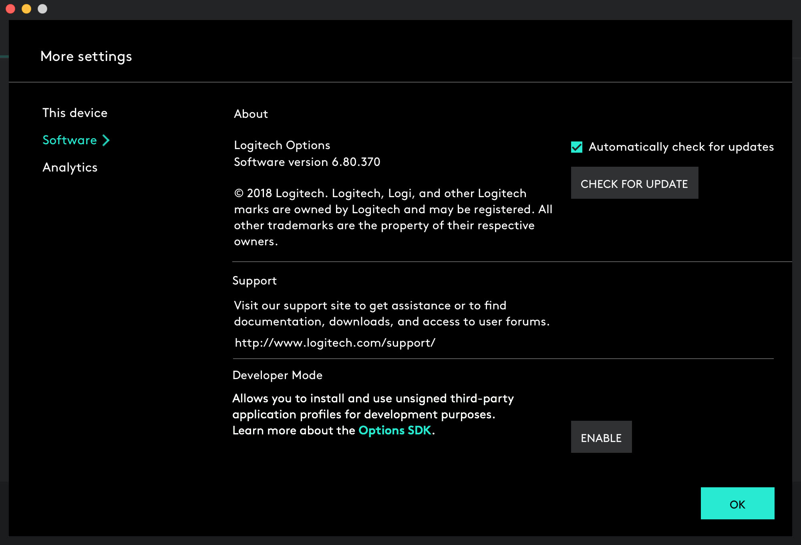
       You will see a Blue banner indicating the same on Options UI.    
       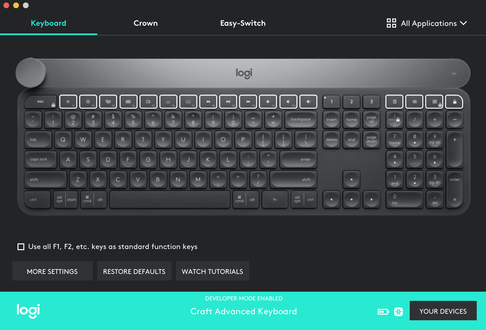

#### Logi Options : Profile creation steps for the sample application
1. Copy the whole folder named 36f0bda7-7562-4c58-8a25-ddb00e9ebabd with its modified defaults.json into 
  ~/Library/Application Support/Logitech/Logitech Options/Plugins folder.
2. Logitech Options will detect the new folder ~/Library/Application Support/Logitech/Logitech Options/Plugins and 
   indicate the same via green bubble in "All Applications" section on UI as shown below.
    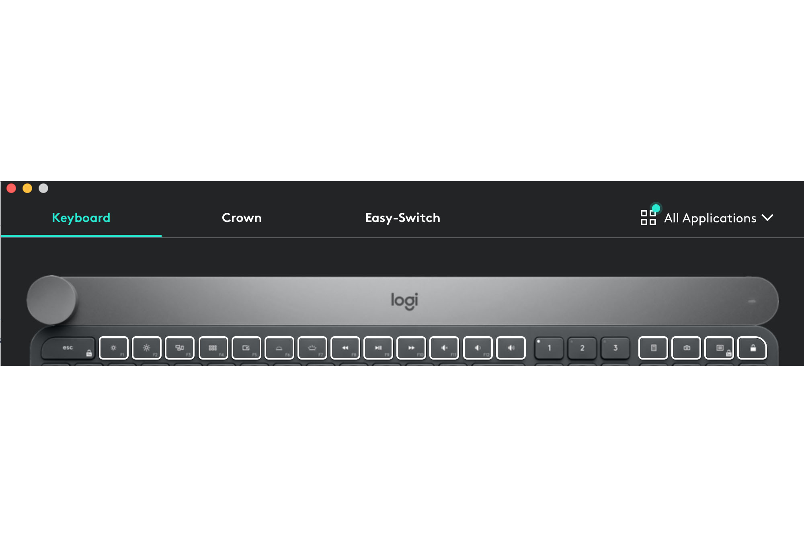
3. Click on "All Applications" on top right of Options UI and click on "Add application" to create a profile for craftest.app 
       as shown in below screenshots.
       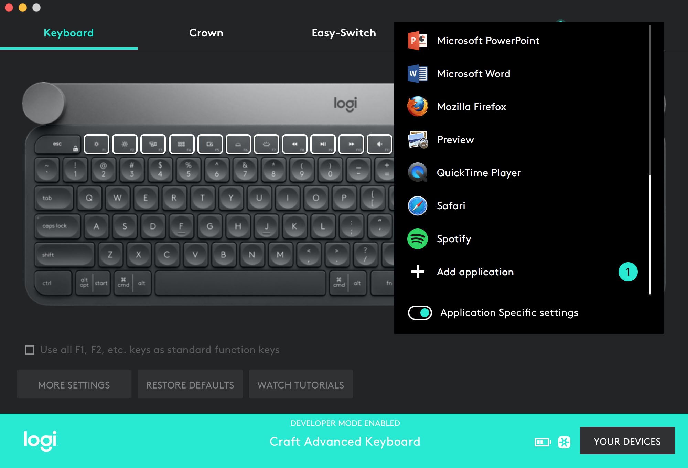
       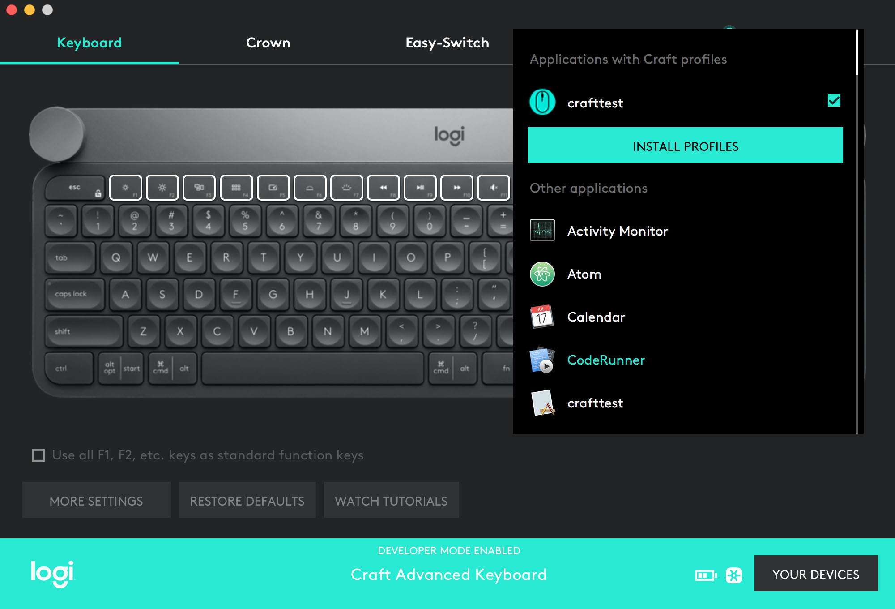
       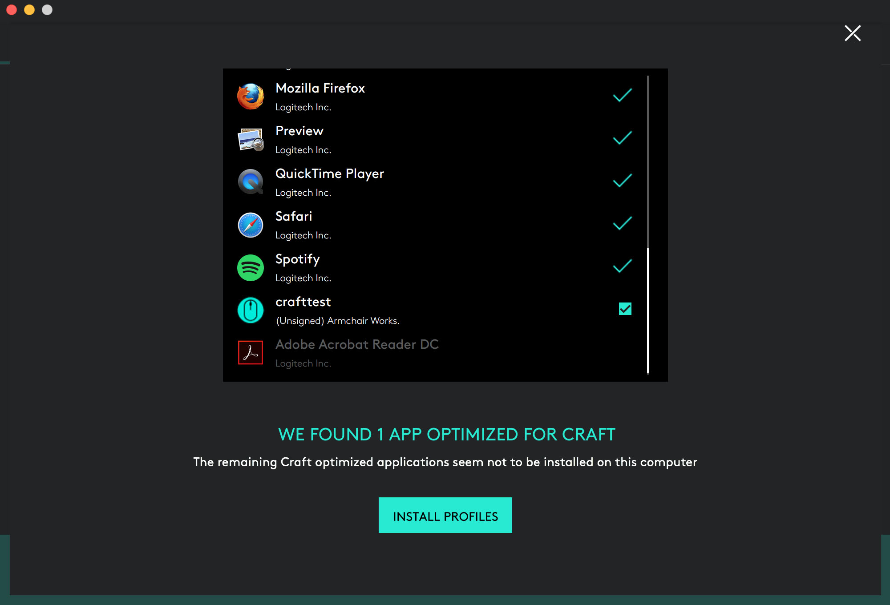
       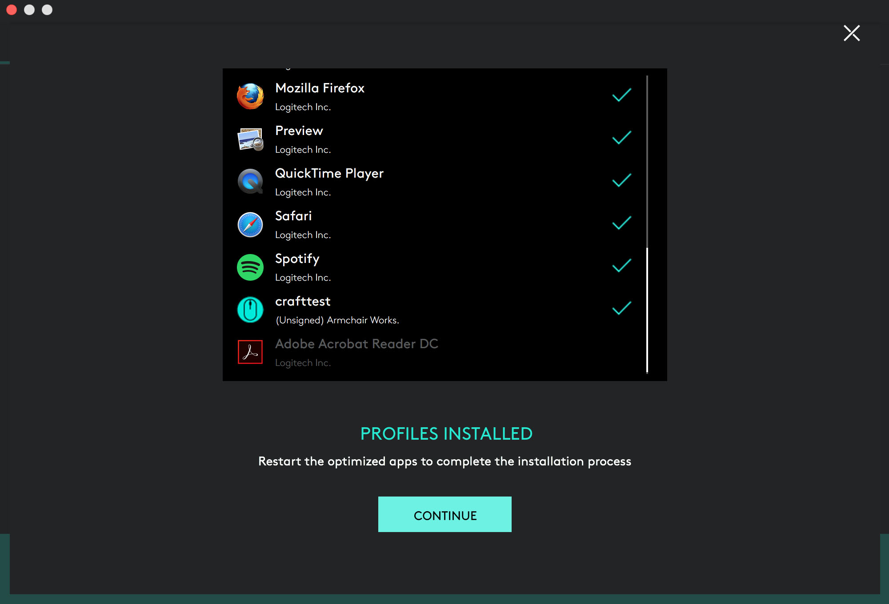
        Note: "Turn left or right" is set to "Contextual" which means you will see context based overlays on crown turn.
       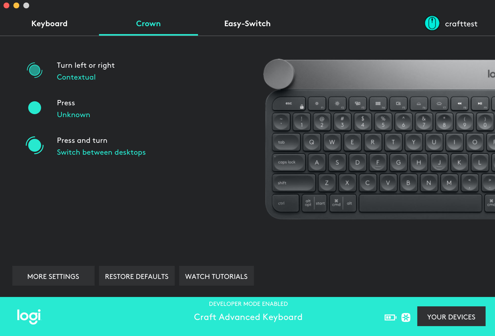
       crafttest.app is now ready to receive crown events whenever it becomes the foreground application on Desktop.
4. Now that profile for crafttest.app has been created, from your Xcode setup, build and run the crafttest.app. If the defaults.json file is configured correctly with right 
       "mac_path" for your app bundle parent folder and right "mac_paths" for your app bundle as shown in example, you should be able to see below on clicking
       connect on UI
       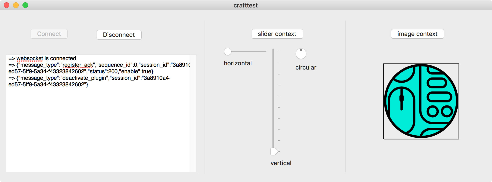
5. On touching crown on the craft smart keyboard, you will see the on screen overlays. 
       On tapping the crown you will navigate through the options.
       On turn you can see the selected option change and real-time updates of its value inside the overlay.

#### Iterating your changes to the application plugin code or its resources
1. If you want to test and debug changes you made to your application plugin code or the plugin resoruces, first delete the
   existing profile by clicking "All Applications" and confirming the deletion of your profile from the Options UI.
   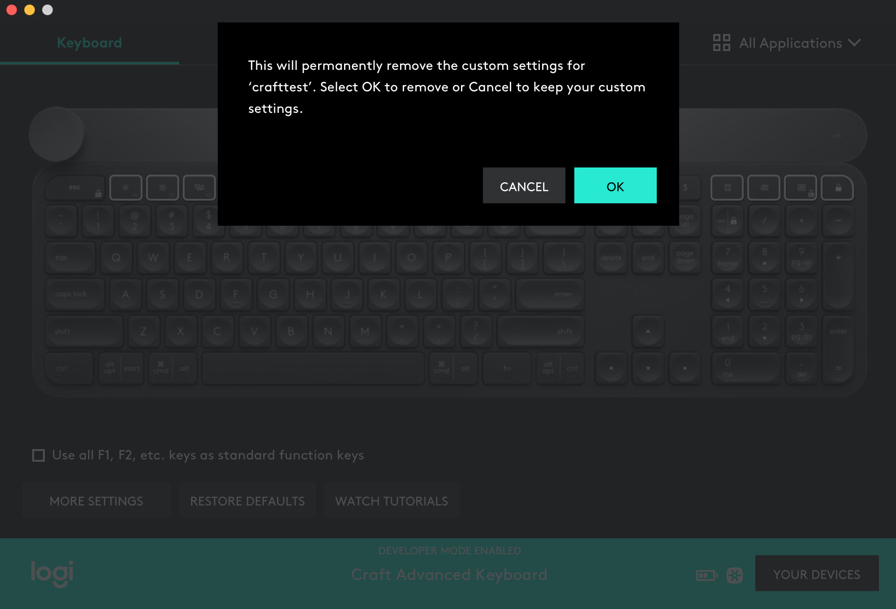
   
2. Make your changes (Ex: Change of application code,  change of supported tool list in tools.json, 
   or change of value of paths, fields in defaults.json) 

3. Copy and overwrite the old application and resources with modified ones and go through the above 
   **"Logi Options : Profile creation steps for the sample application"** steps
4. You can repeat these steps to iterate through your changes to application plugin and/or its plugin resources. 

# Deployment scenario

The above steps are only for development and debug. After development and debug is done, if you want to deploy your application
1. you should put the right values in mac_path, mac_paths fields that reflect a real deployment paths in defaults.json
   Something like 
   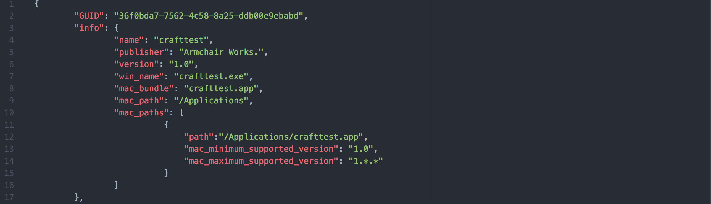
2. Make an installer that will make Craft.framework and SocketRocket.fwk  available in /Library/Frameworks folder 
   of the deployment system, and puts the plugin resource folder in $HOME/Library/Application Support/Logitech/Logitech Options/Plugins
3. Contact Logitech at craftSDK[at]logitech[dot]com for signing and whitelisting of your application plugin so that it works even in non-developer mode.    
