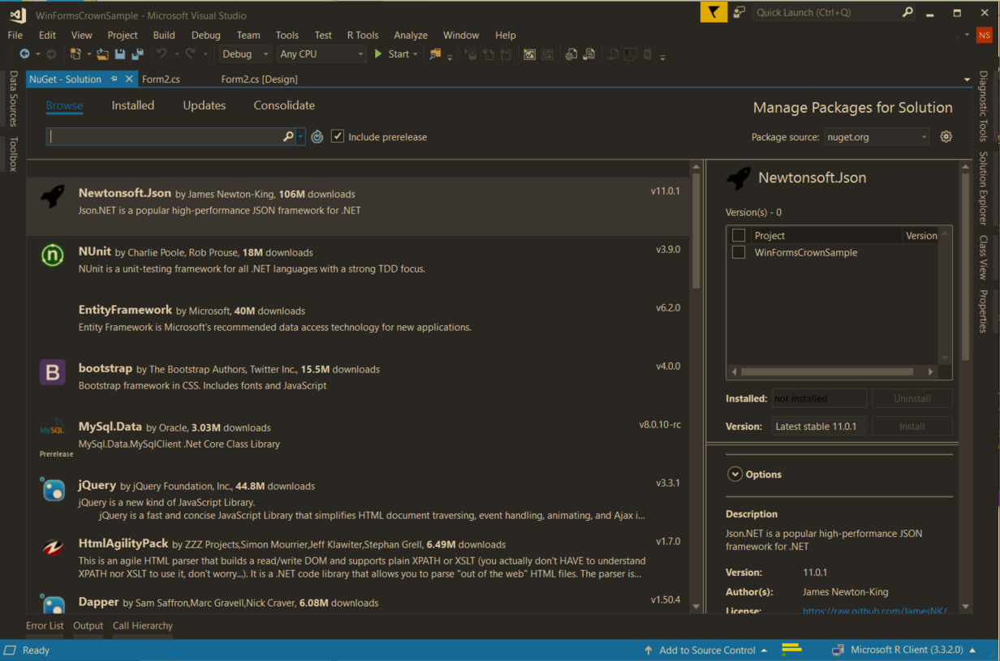
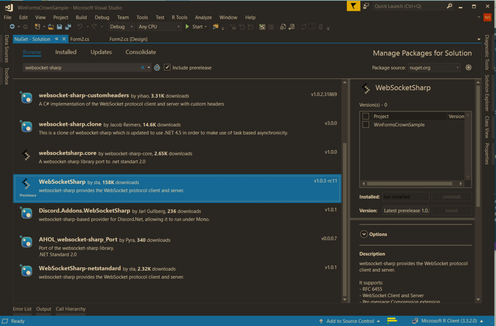
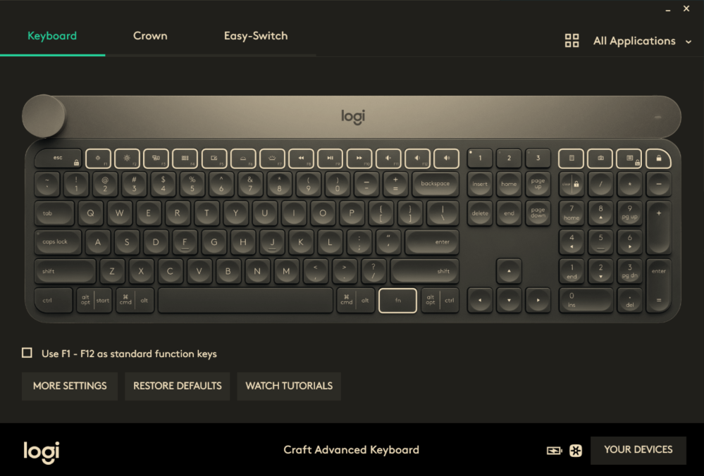
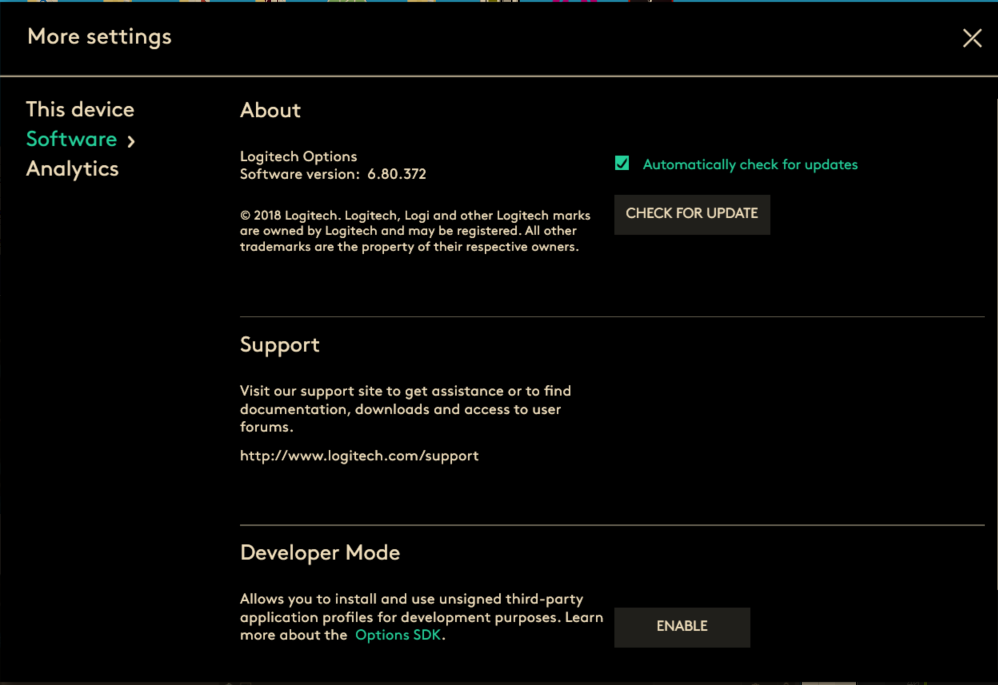
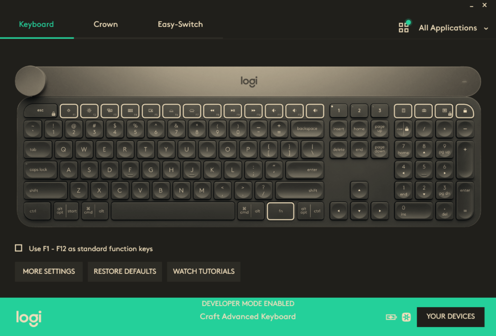
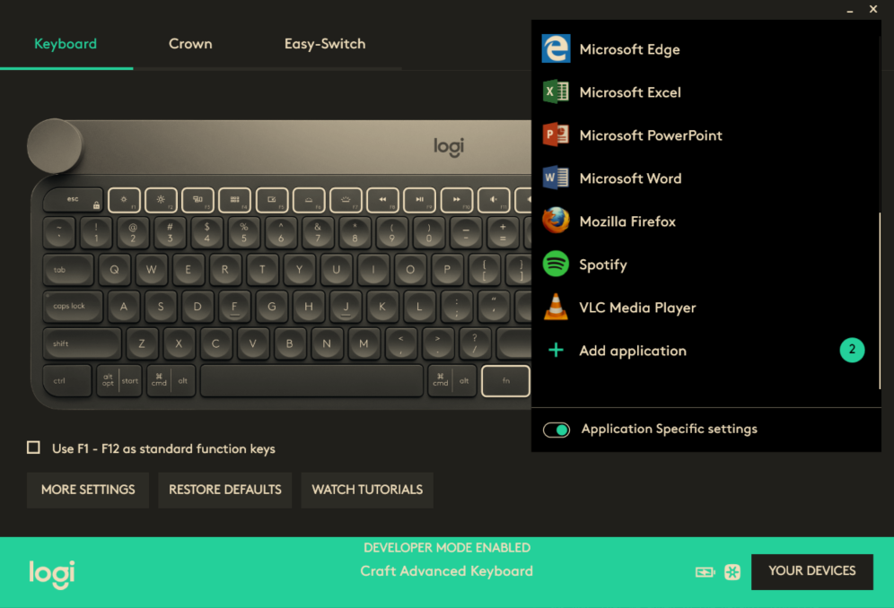
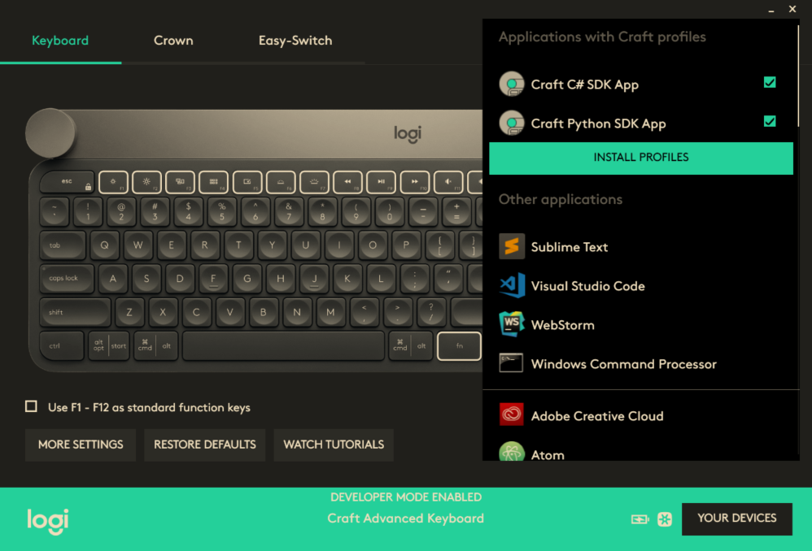
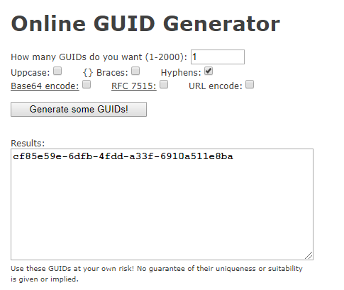
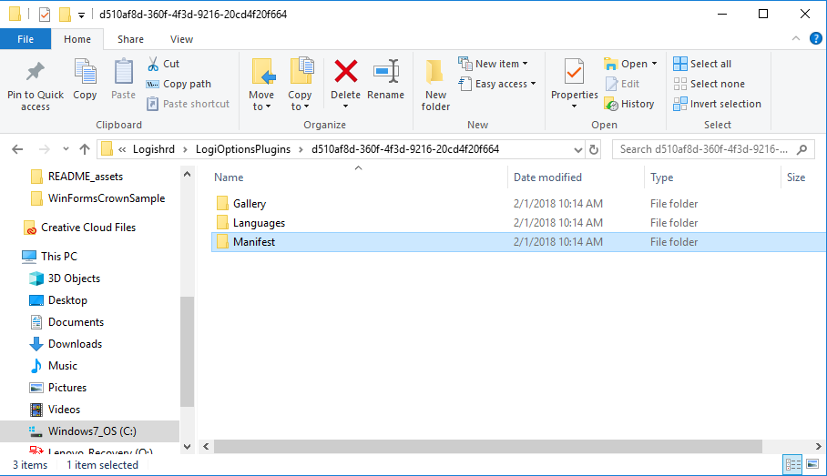

## Getting Started - Craft SDK application development using CSharp (C#)

#### 1. Requirements

Logitech Craft Keyboard (hardware)
https://www.logitech.com/en-us/product/craft
or its localized version.

Logitech Options 6.80 and above (software)
http://support.logitech.com/en_us/software/options
or its localized version must be installed.

#### 2. Setup
Install Visual Studio IDE from (https://www.visualstudio.com/)

Click the WinFormsCrownSample.sln visual studio project file to open the project in Visual Studio.

Install Newtonsoft.json from Visual Studio by selecting Tools > NuGet Package Manager > Manage NuGet Packages for Solution... 



Install WebSocketSharp from Visual Studio by selecting Tools > NuGet Package Manager > Manage NuGet Packages for Solution...



#### 3. Manifest file

Create a folder in windows as shown in the figure. (ProgramData/Logishrd/LogiOptionsPlugins). Copy the sample manifest folder (d510af8d-360f-4f3d-9216-20cd4f20f664) into the LogiOptionsPlugins folder.


Run WinFormsCrownSample.exe from Visual Studio or from command line.

#### 4. Enable Developer Mode
Start Logitech Options and click Craft Advanced Keyboard image


Click MORE SETTINGS



Click ENABLE button from Software menu panel




Click "All Applications" in the top of the panel and scroll the below and next to "Add application" we will see round icon with number of application deteted by the Logitech Options. Click the round icon, which will add the applications to the Logitech Options.



Click "All Applications" and click round icon next to "Add application"



Click "INSTALL PROFILES" to install applications to the Logitech Options



Application added to the list for installation and click "INSTALL PROFILES"


Click CONTINUE button


Applications added to the Logitech Options

 

User can click the controls to get the context and then able to turn the crown in the craft for interaction with various controls in the application.


#### 5. Deployment scenario

Contact Logitech at craftSDK[at]logitech[dot]com for signing and whitelisting of your application plugin so that it works even in non-developer mode.

Below steps are for new manifest file creation

#### 6. GUID creation

Create a GUID (Globally Unique Identifier) using a online GUID generator. Create a folder in the same name as the GUID as shown below. And create 3 folders (Gallery, Languages and Manifest)





#### 7. Manifest folder

Create 2 files in the Manifest folder (defaults.json, tools.json)

defaults.json

```json
{
    "GUID": "d510af8d-360f-4f3d-9216-20cd4f20f664",
    "info": {
        "name": "Craft C# SDK App",
		"publisher": "Logitech Inc.",
        "version": "1.0",
        "win_name": "WinFormsCrownSample.exe",
		
        "mac_bundle": "",
        "mac_path": "",
        "mac_paths": [
            {
                "path": "",
                "mac_minimum_supported_version": "",
                "mac_maximum_supported_version": "",
                "name_suffix": ""
            },
            {
                "path": "",
                "comment": "",
                "mac_minimum_supported_version": "",
                "mac_maximum_supported_version": "",
                "name_suffix": ""
            }
        ],
        "win_minimum_supported_version": "0.0.0",
        "win_maximum_supported_version": "2017.0.1"
    },
    "crown": {
        "rotate": {
            "default_task": "changetoolvalue",
            "tasks": [
                "changetoolvalue"
            ],
            "short_list": [
                "changetoolvalue"
            ]
        },
        "press": {
            "default_task": "playpause",
            "tasks": [
                "playpause"
            ],
            "short_list": [
                "playpause"
            ]
        }
    }
}
```

Change the GUID key to the online generated value. Change the name, publisher, version and win_name as shown in the figure.

tools.json

```json
{
    "GUID": "d510af8d-360f-4f3d-9216-20cd4f20f664",
    "tools": [        
        {
            "name": "ProgressBar",
            "enabled": true,
            "tool_options": [
                {
                    "index": 0,
                    "name": "progressBar",
                    "image_file_path": "textSize.png",
                    "enabled": true,
                    "ratchet_enabled": false
                }
            ]
        },
		{
            "name": "NumericUpDown",
            "enabled": true,
            "tool_options": [
                {
                    "index": 0,
                    "name": "numericUpDown",
                    "image_file_path": "textSize.png",
                    "enabled": true,
                    "ratchet_enabled": false
                }
            ]
        },
		{
            "name": "ListBox",
            "enabled": true,
            "tool_options": [
                {
                    "index": 0,
                    "name": "listBox",
                    "image_file_path": "textSize.png",
                    "enabled": true,
                    "ratchet_enabled": false
                }
            ]
        },
```

Create a tools.json file and add the GUID in the top of the file as shown above. Add other information and name is the name of the control that craft need to control. image_file_path is the image file that is shown in the overlay. ratchet_enabled controls the ratchet or freewheel mode.

#### 8. Languages folder

 Create a file called en.json for English version. The LocalizedStrings contain the ID and value key. ID corresponds to the name in the tool_options in the tools.json.

```json
{
    "LocalizedStrings": [
        {
            "ID": "progressBar",
            "value": "Progress Bar"
        },
        {
            "ID": "numericUpDown",
            "value": "Numeric Up Down"
        },
        {
            "ID": "listBox",
            "value": "List Box"
        },
        {
            "ID": "comboBox",
            "value": "Combo Box"
        },
        {
            "ID": "checkedListBox",
            "value": "Checked List Box"
        },
        {
            "ID": "trackBar",
            "value": "Track Bar"
        },
        {
            "ID": "tabControl",
            "value": "Tab Control"
        },
        {
            "ID": "richTextBox",
            "value": "Rich Text Box"
        },
```

#### 9. Gallery folder

Create a Gallery folder and copy all the image files that are referenced in the tools.json.

 

#### 10. Initialization
The init function connect with the Logi Options using websocket.

```csharp
public void init()
{
    try
    {
        // setup timers 
        SetupUIRefreshTimer();

        // setup connnection 
        connectWithManager();
    }
    catch (Exception ex)
    {
        string str = ex.Message;
    }

}
```

#### 11. Form Initialization

```csharp
public Form2()
{
    InitializeComponent();

    // start the connnection process 
    init();

    progressBar1.Maximum = 1000;
    progressBar1.Step = 1;
    progressBar1.Value = 1;

    numericUpDown1.Minimum = 0;
    numericUpDown1.Maximum = 1000;

    for (int i = 0; i < 1000; i++)
    {
        listBox1.Items.Add(i.ToString());
    }
    listBox1.SelectedIndex = 0;

    for (int i = 0; i < 1000; i++)
    {
        comboBox1.Items.Add(i.ToString());
    }
    comboBox1.SelectedIndex = 0;

    for (int i = 0; i < 1000; i++)
    {
        checkedListBox1.Items.Add(i.ToString());
    }
    checkedListBox1.SetItemChecked(0,true);

    trackBar1.Minimum = 0;
    trackBar1.Maximum = 100;
}

```
Above code intializes all the controls in the form to some default value.

#### 12. Registration

```csharp
public static void connectWithManager()
{
    try
    {
        client = new WebSocket(host);

        client.OnOpen += (ss, ee) =>
            openUI(string.Format("Connected to {0} successfully", host));
        client.OnError += (ss, ee) =>
            displayError("Error: " + ee.Message);

        client.OnMessage += (ss, ee) =>
            wrapperUpdateUI(ee.Data);

        client.OnClose += (ss, ee) =>
            closeConnection();

        client.Connect();

        // build the connection request packet 
        Process currentProcess = Process.GetCurrentProcess();
        CrownRegisterRootObject registerRootObject = new CrownRegisterRootObject();
        registerRootObject.message_type = "register";
        registerRootObject.plugin_guid = "d510af8d-360f-4f3d-9216-20cd4f20f664";
        registerRootObject.execName = "WinFormsCrownSample.exe";
        registerRootObject.PID = Convert.ToInt32(currentProcess.Id);
        string s = JsonConvert.SerializeObject(registerRootObject);


        // only connect to active session process
        registerRootObject.PID = Convert.ToInt32(currentProcess.Id);
        int activeConsoleSessionId = WTSGetActiveConsoleSessionId();
        int currentProcessSessionId = Process.GetCurrentProcess().SessionId;

        // if we are running in active session?
        if (currentProcessSessionId == activeConsoleSessionId)
        {
            client.Send(s);
        }
        else
        {
            Trace.TraceInformation("Inactive user session. Skipping connect");
        }

```

Above code creates a WebSocket and register with Logi Options by providing the message type, plugin guid, Process ID and application name. Newtonsoft helps to serialize the object and send it to the Logi Options. On successful connection from the Logi Options, this application receives a json object with the following parameter (message type, sequence ID, session ID and status). The data from the Logi Options is correct if the status message is 200.

#### 13. Craft message handler

```csharp
public static void wrapperUpdateUI(string msg)
{
    Trace.Write("msg :" + msg + "\n");
    CrownRootObject crownRootObject = JsonConvert.DeserializeObject<CrownRootObject>(msg);

    if ((crownRootObject.message_type == "crown_turn_event"))
    {
        crownObjectList.Add(crownRootObject);
        Trace.Write("**** UI crown ratchet delta :" + crownRootObject.ratchet_delta + " slot delta = " + crownRootObject.delta + "\n");

        
    }
    else if (crownRootObject.message_type == "register_ack")
    {
        // save the session id as this is used for any communication with Logi Options 
        sessionId = crownRootObject.session_id;
        //toolChange("nothing");
        lastcontext = "";

        if (sendContextChange)
        {
            sendContextChange = false;
            toolChange("ProgressBar");
        }
        else
        {

            toolChange("ProgressBar");
        }

    }
}

```

The Craft sends series of json object to the application if user turn the crown. The application stores the json object into crownObjectList. If the application receives the register acknowledgement message from the Logi Options then the application will send tool change message to the Logi Options (default to Progress Bar).

#### 14. Timer and event handler

```csharp
 public static void timer_Elapsed(object sender, System.Timers.ElapsedEventArgs e)
{
    try
    {
        
        int totalDeltaValue = 0;
        int totalRatchetDeltaValue = 0;
        if (crownObjectList == null || crownObjectList.Count == 0)
        {
            //Trace.Write("Queue is empty\n");
            return;
        }
        else
        {
            //Trace.Write("Queue size is: " + crownObjectList.Count + "\n");
        }

        string currentToolOption = crownObjectList[0].task_options.current_tool_option;

        //Trace.Write("currentToolOption is: " + currentToolOption + "\n");
        CrownRootObject crownRootObject = crownObjectList[0];
        int count = 0;
        for (int i = 0; i < crownObjectList.Count; i++)
        {
            if (currentToolOption == crownObjectList[i].task_options.current_tool_option)
            {
                totalDeltaValue = totalDeltaValue + crownObjectList[i].delta;
                totalRatchetDeltaValue = totalRatchetDeltaValue + crownObjectList[i].ratchet_delta;
            }
            else
                break;

            count++;
        }

        if (crownObjectList.Count >= 1)
        {
            crownObjectList.Clear();

            crownRootObject.delta = totalDeltaValue;
            crownRootObject.ratchet_delta = totalRatchetDeltaValue;
            //Trace.Write("Ratchet delta is :" + totalRatchetDeltaValue + "\n");
            updateUIWithDeserializedData(crownRootObject);
        }
    }
    catch (Exception ex)
    {
        string str = ex.Message;
    }
}

```

The above code calculates the delta and ratchet value from the json object stored in the crownObjectList. Above code updated the crownRootObject with delta and ratchet value and pass that object to updateUIWithDeserializeData.
 
#### 15. Craft message handler

```csharp
public static void updateUIWithDeserializedData(CrownRootObject crownRootObject)
{
    int progressValue = 0;
    if (crownRootObject.message_type == "deactivate_plugin")
        return;

    try
    {
        if (crownRootObject.message_type == "crown_turn_event")
        {
            // received a crown turn event from Craft crown
            Trace.Write("++ crown ratchet delta :" + crownRootObject.ratchet_delta + " slot delta = " + crownRootObject.delta + "\n");

            switch (crownRootObject.task_options.current_tool)
            {
                case "ProgressBar":
                    progressValue = m_form2.progressBar1.Value + crownRootObject.delta;

                    if(progressValue < 0)
                    {
                        progressValue = 0;
                    }

                    if(progressValue > 1000)
                    {
                        progressValue = 1000;
                    }

                    m_form2.progressBar1.Invoke(new Action(() => m_form2.progressBar1.Value = progressValue));
                    break;

                case "NumericUpDown":
                    int numericValue = (int)m_form2.numericUpDown1.Value + crownRootObject.delta;
                    
                    if(numericValue < 0)
                    {
                        numericValue = 0;
                    }

                    if(numericValue > 1000)
                    {
                        numericValue = 1000;
                    }

                    m_form2.numericUpDown1.Invoke(new Action(() => m_form2.numericUpDown1.Value = numericValue));
                    break;

                case "ListBox":
                    int listIndex = 0;
                    m_form2.listBox1.Invoke(new Action(() =>  listIndex = m_form2.listBox1.SelectedIndex));
                    listIndex = listIndex + crownRootObject.delta;

                    if (listIndex < 0)
                    {
                        listIndex = 0;
                    }

```

The above code receives the CrownRootObject and based on the message type, it process the data. If the message type is turn event and for example if the current tool is Progress Bar then it read the value from the progress bar object and adds delta to that value. Using lambda expression, we can create an Action delegate inline. The lambda function helps to set the delta value to the Progress bar.

#### 16. Click event

```csharp
private void progressBar1_Click(object sender, EventArgs e)
{
    toolChange("ProgressBar");
}

```

If user click any controls on the form then the application sends tool change command to the Logi Options.


#### 17. Tool change

```csharp
public static void toolChange(string contextName)
{
    try
    {
        ToolChangeObject toolChangeObject = new ToolChangeObject();
        toolChangeObject.message_type = "tool_change";
        toolChangeObject.session_id = sessionId;
        toolChangeObject.tool_id = contextName;

        string s = JsonConvert.SerializeObject(toolChangeObject);
        client.Send(s);

    }
    catch (Exception ex)
    {
        string err = ex.Message;
    }
}

```

The above function creates a tool change object and initializes its instance variables like message type, session id and tool id. Then sends this object to the Logi Options.
